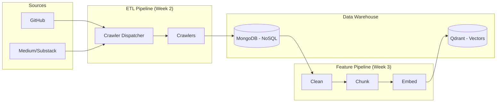
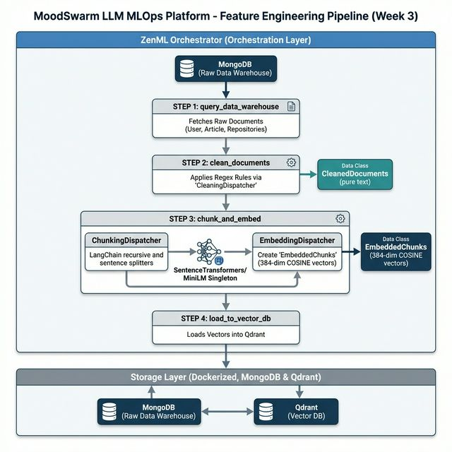
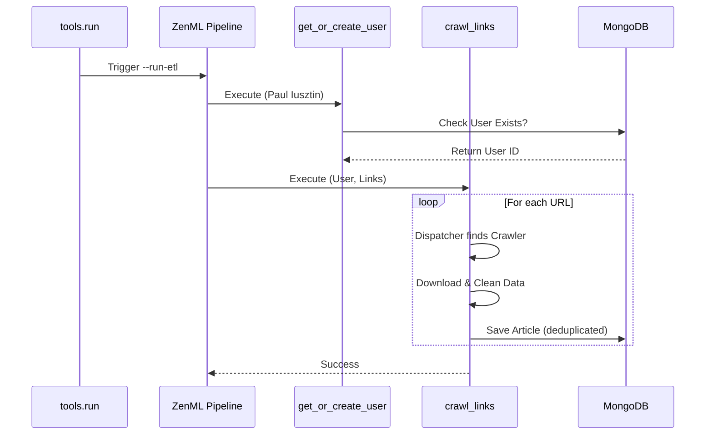
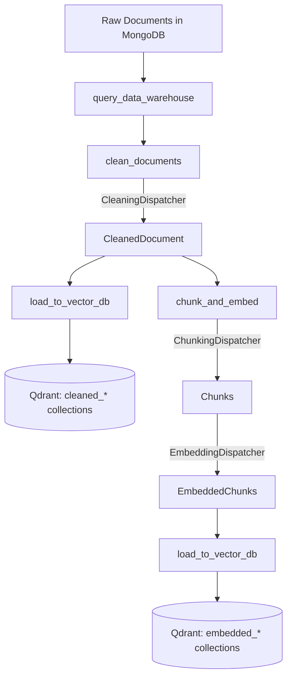

# 🧠 MoodSwarm: LLM Twin & MLOps Platform

> **The Goal:** Build an end-to-end AI system that learns to mimic a specific persona's writing style and knowledge base using the **FTI (Feature, Training, Inference) Architecture**.

---

## 🏗️ System Architecture

### High-Level Data Flow
This diagram illustrates how data travels from the internet into our Vector Store.





### Tech Stack & Design Decisions
| Component | Technology | Why? |
|-----------|------------|------|
| **Orchestrator** | **ZenML** | Decouples code from infra; reproducible pipeline runs. |
| **Database** | **MongoDB** | Schemaless storage for raw unstructured data (blogs, code). |
| **Vector DB** | **Qdrant** | High-performance vector search for RAG. |
| **Language** | **Python 3.11** | Modern AI standard with **Poetry** for dependency management. |
| **Design** | **DDD** | Domain-Driven Design for modular, maintainable code. |

---

## 📅 Engineering Journal (Progress Log)

### 🔄 Week 3: RAG Feature Pipeline (In Progress)
**Objective:** Build the clean → chunk → embed → Qdrant vector store pipeline.
- **Architecture Strategy:** `Strategy + Dispatcher` pattern across 3 processing stages.
- **Achievements (Days 1-2):**
    - **Qdrant Infrastructure:** Singleton `QdrantDatabaseConnector` with local Docker + Cloud support.
    - **Vector ODM Layer:** `VectorBaseDocument` base class with `bulk_insert`, `search`, auto-collection creation (COSINE, 384-dim).
    - **Domain Models:** 9 new models across 3 layers:
        - **Cleaned:** `CleanedPostDocument`, `CleanedArticleDocument`, `CleanedRepositoryDocument` (no vectors)
        - **Chunks:** `PostChunk`, `ArticleChunk`, `RepositoryChunk` (intermediate, deterministic UUIDs)
        - **Embedded:** `EmbeddedPostChunk`, `EmbeddedArticleChunk`, `EmbeddedRepositoryChunk` (384-dim COSINE vectors)
    - **Embedding Model:** `EmbeddingModelSingleton` wrapping `sentence-transformers/all-MiniLM-L6-v2` (384-dim, 256 max tokens).
    - **Preprocessing Pipeline:**
        - **Cleaning:** Regex-based text normalization per document type.
        - **Chunking:** Type-specific strategies — Posts (250 tok/25 overlap), Articles (1000-2000 chars sentence-aware), Repos (1500 tok/100 overlap).
        - **Embedding:** Batch encoding via SentenceTransformers with model metadata capture.
    - **Design Patterns Applied:**
        - **Strategy Pattern:** Abstract handlers per processing stage (clean/chunk/embed).
        - **Factory Pattern:** `CleaningHandlerFactory`, `ChunkingHandlerFactory`, `EmbeddingHandlerFactory`.
        - **Dispatcher Pattern:** `CleaningDispatcher`, `ChunkingDispatcher`, `EmbeddingDispatcher` route by `DataCategory`.
        - **Singleton Pattern:** Thread-safe `SingletonMeta` for embedding models.
- **Remaining (Days 3-7):** ZenML pipeline steps + CLI, end-to-end run, Qdrant verification, CDC sync, lint + docs.

### ✅ Week 2: Digital Data ETL Pipeline
**Objective:** Ingestion engine to scrape the internet.
- **Architecture Pattern:** `Dispatcher` -> `Worker` Strategy.
- **Achievements:**
    - **Crawlers:** Custom scrapers for GitHub (Code), Medium (Selenium), and generic sites.
    - **Resilience:** Exponential backoff retry logic + Deduplication checks.
    - **Data Modeling:** Strict MongoDB schemas (`User`, `Article`, `Repository`).

### ✅ Week 1: Infrastructure Foundation
**Objective:** Scalable, reproducible MLOps environment.
- **Achievements:**
    - Docker Compose for persistence (Mongo + Qdrant).
    - ZenML orchestration setup.
    - Pydantic Settings for type-safe config.

---

## 🔍 Deep Dive: Pipeline Logic

### ETL Pipeline (Extraction)
How we get data *into* the system.


### Feature Pipeline (Transformation)
How we turn text into vectors.


---

## 🚀 How to Run

### 1. Start Infrastructure
```bash
docker-compose up -d
```

### 2. Run Pipelines
```bash
# Ingest Data (Week 2)
poetry run python -m tools.run --run-etl

# Validate Infrastructure (Week 1)
poetry run python -m tools.run --run-smoke-test
```

### 3. Monitoring
```bash
poetry run zenml login --local
```
