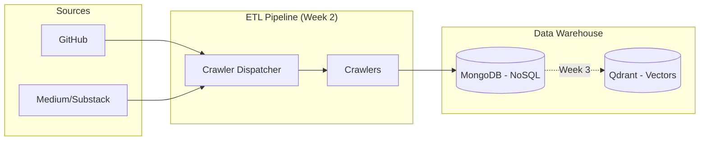
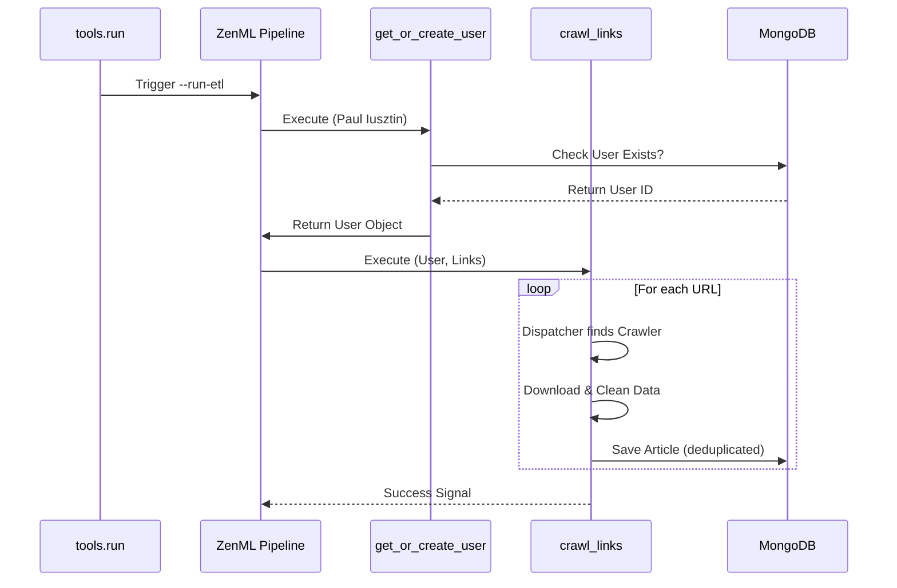

# MoodSwarm: LLM Twin & MLOps Platform

> **Goal:** Build an end-to-end LLM system that mimics a specific persona's writing style using the FTI (Feature, Training, Inference) architecture.

---

## 📅 Project Progress Log

### ✅ Week 1: Infrastructure Foundation
**Objective:** Set up a scalable, reproducible MLOps environment.
- **Tech Stack:** Python 3.11, Poetry, Docker, ZenML.
- **Achievements:**
    - Established **Domain-Driven Design (DDD)** folder structure (`domain/`, `application/`, `infrastructure/`).
    - Configured **Docker Compose** for persistence layer (MongoDB + Qdrant).
    - Initialized **ZenML** as the orchestration engine.
    - Implemented **Pydantic Settings** management for type-safe configuration.
    - Created a **Smoke Test Pipeline** to verify database connectivity automatically.

### ✅ Week 2: Digital Data ETL Pipeline
**Objective:** Build the ingestion engine to scrape and normalize unstructured data.
- **Architecture:** `Dispatcher` -> `Worker` pattern.
- **Achievements:**
    - **Domain Modeling:** Designed MongoDB ODM models (`User`, `Article`, `Repository`) with strict validation.
    - **Crawlers:** Built modular scrapers for:
        - **GitHub** (Clones repos, extracts code).
        - **Medium** (Selenium headless browser).
        - **Custom/Substack** (LangChain HTML parsing).
    - **Design Patterns Applied:**
        - **Strategy Pattern:** `BaseCrawler` interface for extensible workers.
        - **Factory Pattern:** `CrawlerDispatcher` for dynamic worker selection.
        - **Singleton Pattern:** `MongoDatabaseConnector` for efficient connection pooling.
    - **Pipeline:** Implemented `digital_data_etl` in ZenML to orchestrate user creation and crawling.
    - **Hardening:** Added **Exponential Backoff** (retry logic) and Deduplication checks.

### 📊 Visual Architecture

**1. High-Level System Architecture**


**2. ETL Pipeline Execution Flow**


---

## 🚀 How to Run

### 1. Start Infrastructure
```bash
docker-compose up -d
```

### 2. Run the ETL Pipeline
```bash
poetry run python -m tools.run --run-etl
```

### 3. Verification
Check the ZenML dashboard:
```bash
poetry run zenml login --local
```
