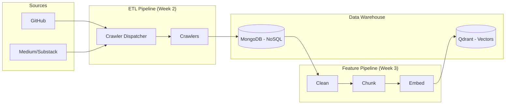
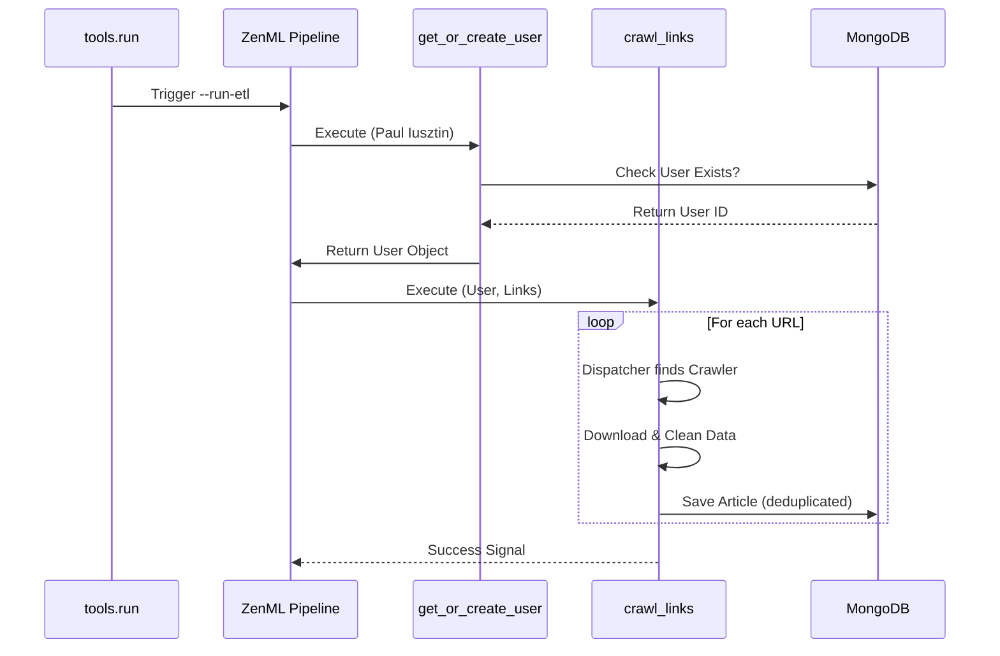
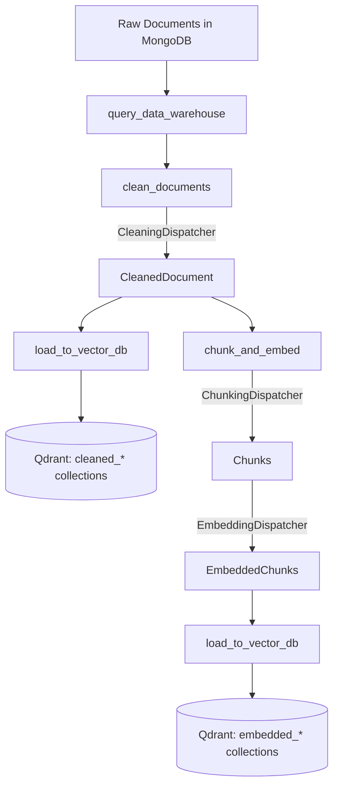

# MoodSwarm: LLM Twin & MLOps Platform

> **Goal:** Build an end-to-end LLM system that mimics a specific persona's writing style using the FTI (Feature, Training, Inference) architecture.

---

## 📅 Project Progress Log

### ✅ Week 1: Infrastructure Foundation
**Objective:** Set up a scalable, reproducible MLOps environment.
- **Tech Stack:** Python 3.11, Poetry, Docker, ZenML.
- **Achievements:**
    - Established **Domain-Driven Design (DDD)** folder structure (`domain/`, `application/`, `infrastructure/`).
    - Configured **Docker Compose** for persistence layer (MongoDB + Qdrant).
    - Initialized **ZenML** as the orchestration engine.
    - Implemented **Pydantic Settings** management for type-safe configuration.
    - Created a **Smoke Test Pipeline** to verify database connectivity automatically.

### ✅ Week 2: Digital Data ETL Pipeline
**Objective:** Build the ingestion engine to scrape and normalize unstructured data.
- **Architecture:** `Dispatcher` -> `Worker` pattern.
- **Achievements:**
    - **Domain Modeling:** Designed MongoDB ODM models (`User`, `Article`, `Repository`) with strict validation.
    - **Crawlers:** Built modular scrapers for:
        - **GitHub** (Clones repos, extracts code).
        - **Medium** (Selenium headless browser).
        - **Custom/Substack** (LangChain HTML parsing).
    - **Design Patterns Applied:**
        - **Strategy Pattern:** `BaseCrawler` interface for extensible workers.
        - **Factory Pattern:** `CrawlerDispatcher` for dynamic worker selection.
        - **Singleton Pattern:** `MongoDatabaseConnector` for efficient connection pooling.
    - **Pipeline:** Implemented `digital_data_etl` in ZenML to orchestrate user creation and crawling.
    - **Hardening:** Added **Exponential Backoff** (retry logic) and Deduplication checks.

### 🔄 Week 3: RAG Feature Pipeline (In Progress — Day 2/7)
**Objective:** Build the clean → chunk → embed → Qdrant vector store pipeline.
- **Architecture:** `Strategy + Dispatcher` pattern across 3 processing stages.
- **Achievements (Days 1-2):**
    - **Qdrant Infrastructure:** Singleton `QdrantDatabaseConnector` with local Docker + Cloud support.
    - **Vector ODM:** `VectorBaseDocument` base class with `bulk_insert`, `search`, auto-collection creation (COSINE, 384-dim).
    - **Domain Models:** 9 new models across 3 layers:
        - **Cleaned:** `CleanedPostDocument`, `CleanedArticleDocument`, `CleanedRepositoryDocument` (no vectors)
        - **Chunks:** `PostChunk`, `ArticleChunk`, `RepositoryChunk` (intermediate, deterministic UUIDs)
        - **Embedded:** `EmbeddedPostChunk`, `EmbeddedArticleChunk`, `EmbeddedRepositoryChunk` (384-dim COSINE vectors)
    - **Embedding Model:** `EmbeddingModelSingleton` wrapping `sentence-transformers/all-MiniLM-L6-v2` (384-dim, 256 max tokens).
    - **Preprocessing Pipeline:**
        - **Cleaning:** Regex-based text normalization per document type.
        - **Chunking:** Type-specific strategies — Posts (250 tok/25 overlap), Articles (1000-2000 chars sentence-aware), Repos (1500 tok/100 overlap).
        - **Embedding:** Batch encoding via SentenceTransformers with model metadata capture.
    - **Design Patterns Applied:**
        - **Strategy Pattern:** Abstract handlers per processing stage (clean/chunk/embed).
        - **Factory Pattern:** `CleaningHandlerFactory`, `ChunkingHandlerFactory`, `EmbeddingHandlerFactory`.
        - **Dispatcher Pattern:** `CleaningDispatcher`, `ChunkingDispatcher`, `EmbeddingDispatcher` route by `DataCategory`.
        - **Singleton Pattern:** Thread-safe `SingletonMeta` for embedding/cross-encoder models.
- **Remaining (Days 3-7):** ZenML pipeline steps + CLI, end-to-end run, Qdrant verification, CDC sync, lint + docs.

### 📊 Visual Architecture

**1. High-Level System Architecture**


**2. ETL Pipeline Execution Flow**


**3. Feature Pipeline Processing Flow (Week 3)**


---

## 🚀 How to Run

### 1. Start Infrastructure
```bash
docker-compose up -d
```

### 2. Run the ETL Pipeline
```bash
poetry run python -m tools.run --run-etl
```

### 3. Verification
Check the ZenML dashboard:
```bash
poetry run zenml login --local
```
