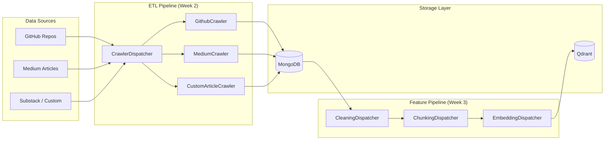
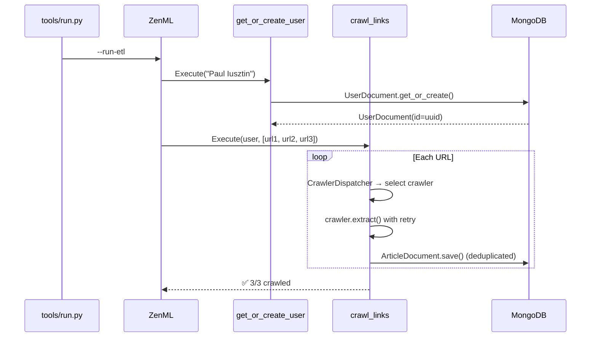
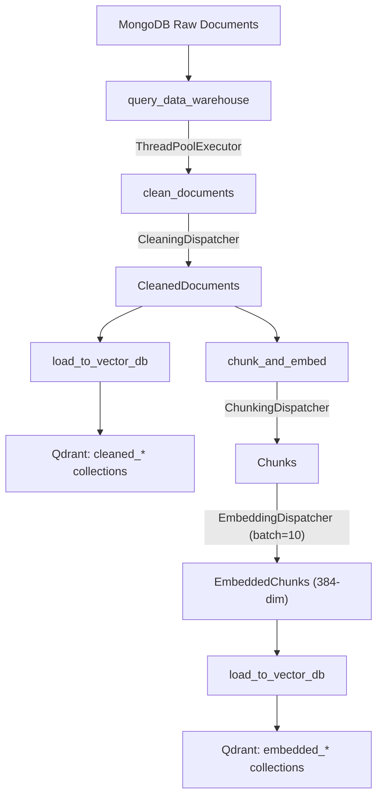
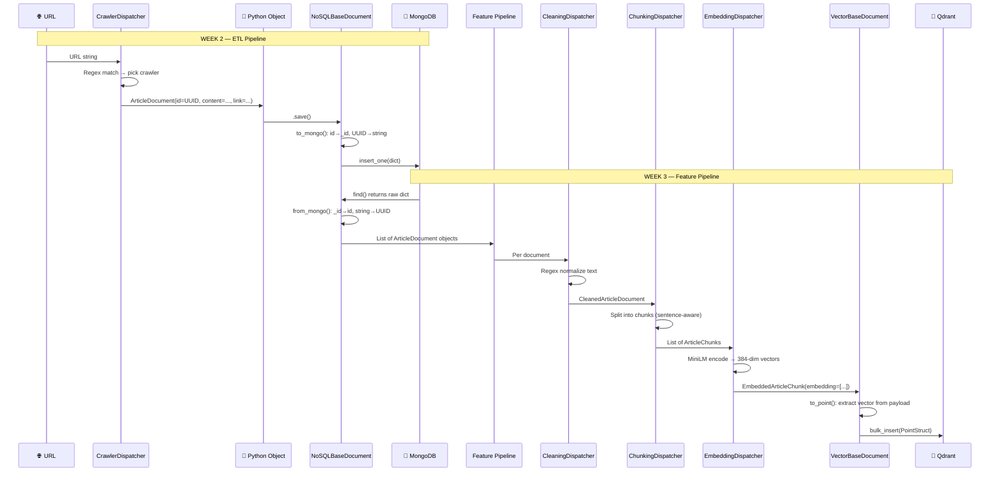

# 🧠 MoodSwarm: LLM Twin & MLOps Platform

> Build an end-to-end AI system that mimics a specific persona's writing style and knowledge using the **FTI (Feature, Training, Inference) Architecture**.


### Progress

| Week | Phase | Status |
|------|-------|--------|
| 1 | Infrastructure & Environment Setup | Done |
| 2 | Digital Data ETL Pipeline | Done |
| 3 | RAG Feature Pipeline & Semantic Search | Done |
| 4 | RAG Retrieval & Inference | Next |
| 5 | Instruction Dataset & SFT Training | Pending |
| 6 | DPO Preference Alignment & Evaluation | Pending |
| 7 | Inference Optimization & Deployment | Pending |
| 8 | MLOps, Monitoring & Capstone | Pending |

---

## 🏗️ System Architecture

### End-to-End Data Flow


### Tech Stack
| Layer | Technology | Purpose |
|-------|------------|---------|
| Orchestration | **ZenML** | Pipeline DAGs, caching, artifact versioning |
| Raw Storage | **MongoDB** | Schemaless document store for crawled data |
| Vector Storage | **Qdrant** | ANN search with HNSW indexing (384-dim COSINE) |
| Embeddings | **all-MiniLM-L6-v2** | Sentence-level encoding (384 dimensions) |
| Language | **Python 3.11 + Poetry** | Reproducible dependency management |
| Containers | **Docker Compose** | Local MongoDB + Qdrant infrastructure |
| Architecture | **DDD** | Domain-Driven Design with layered separation |

---

## 📂 Project Structure

```
moodSwarm/
├── llm_engineering/                    # Core DDD Package
│   ├── domain/                         # Data Models (Pure Python, no external deps)
│   │   ├── base/
│   │   │   ├── nosql.py                #   MongoDB ODM (CRUD, UUID handling)
│   │   │   └── vector.py              #   Qdrant ODM (bulk_insert, search, auto-collection)
│   │   ├── documents.py               #   UserDocument, ArticleDocument, RepositoryDocument, PostDocument
│   │   ├── cleaned_documents.py       #   CleanedArticleDocument, CleanedPostDocument, CleanedRepositoryDocument
│   │   ├── chunks.py                  #   ArticleChunk, PostChunk, RepositoryChunk
│   │   ├── embedded_chunks.py         #   EmbeddedArticleChunk, EmbeddedPostChunk, EmbeddedRepositoryChunk
│   │   ├── queries.py                 #   Query, EmbeddedQuery (RAG retrieval query models)
│   │   ├── types.py                   #   DataCategory enum (posts, articles, repositories, prompts, datasets...)
│   │   └── exceptions.py             #   LLMTwinException, ImproperlyConfigured
│   │
│   ├── application/                    # Business Logic
│   │   ├── crawlers/                  #   GithubCrawler, MediumCrawler, CustomArticleCrawler, CrawlerDispatcher
│   │   ├── preprocessing/             #   Cleaning / Chunking / Embedding handlers + dispatchers + factories
│   │   │   ├── dispatchers.py         #     CleaningDispatcher, ChunkingDispatcher, EmbeddingDispatcher
│   │   │   ├── cleaning_data_handlers.py
│   │   │   ├── chunking_data_handlers.py
│   │   │   ├── embedding_data_handlers.py
│   │   │   └── operations/            #     Low-level chunking + cleaning regex operations
│   │   ├── networks/                  #   EmbeddingModelSingleton, CrossEncoderModelSingleton
│   │   └── utils/                     #   split_user_full_name, batch()
│   │
│   ├── infrastructure/                 # External System Adapters
│   │   └── db/
│   │       ├── mongo.py               #   MongoDatabaseConnector (Singleton)
│   │       └── qdrant.py              #   QdrantDatabaseConnector (Singleton)
│   │
│   ├── model/                          # ML Model Code (future: SFT, DPO)
│   └── settings.py                     # Pydantic Settings (.env loader)
│
├── pipelines/                          # ZenML Pipeline Definitions
│   ├── smoke_test.py                  #   Verify MongoDB + Qdrant connectivity
│   ├── digital_data_etl.py            #   get_or_create_user → crawl_links
│   └── feature_engineering.py         #   query_data_warehouse → clean → chunk_and_embed → load_to_vector_db
│
├── steps/                              # ZenML Step Implementations
│   ├── etl/
│   │   ├── get_or_create_user.py      #   User lookup/creation + metadata logging
│   │   └── crawl_links.py             #   Dispatcher-based crawling with retry + backoff
│   └── feature_engineering/
│       ├── query_data_warehouse.py    #   Concurrent MongoDB fetch (ThreadPoolExecutor)
│       ├── clean.py                   #   CleaningDispatcher per document
│       ├── rag.py                     #   ChunkingDispatcher → EmbeddingDispatcher (batch=10)
│       └── load_to_vector_db.py       #   group_by_class → bulk_insert to Qdrant
│
├── configs/                            # Pipeline Parameter Files
│   ├── digital_data_etl.yaml          #   User name + list of URLs to crawl
│   └── feature_engineering.yaml       #   Author names for feature extraction
│
├── tools/                              # CLI Utilities
│   ├── run.py                         #   Main CLI (--run-smoke-test | --run-etl | --run-feature-engineering)
│   ├── data_warehouse.py              #   MongoDB export/import (JSON backup/restore)
│   ├── qdrant_inspect.py             #   Qdrant CLI (list-collections, stats, sample, semantic search)
│   ├── chunk_analysis.py             #   Chunk validation (token distribution stats + PASS/FAIL limit check)
│   └── search_test.py               #   End-to-end semantic search across all embedded collections
│
├── interview/
│   └── INTERVIEW_QUESTIONS.md         #   41 interview Q&A derived from this codebase
│
├── docs/
│   └── data_save_flow.html            #   Interactive visualization of the data save flow
│
├── data/data_warehouse_raw_data/       #   Pre-crawled JSON data for offline import
├── docker-compose.yml                  #   MongoDB + Qdrant containers
└── pyproject.toml                      #   Poetry config + Poe tasks
```

---

## 📅 Engineering Journal

### 🔜 Week 4: RAG Retrieval & Inference *(Next)*
**Objective:** Advanced retrieval with query expansion, reranking, and baseline quality metrics.

- Self-query metadata extraction, query expansion, filtered vector search
- Reranking with CrossEncoder post-retrieval optimization
- Recall@K, MRR baselines and regression test set

### ✅ Week 3: RAG Feature Pipeline & Semantic Search
**Objective:** Transform raw text into searchable vectors in Qdrant, with end-to-end query capability.

**Feature Engineering Pipeline** (`feature_engineering`) with 4 ZenML steps:
1. `query_data_warehouse` — concurrent MongoDB fetch via `ThreadPoolExecutor`
2. `clean_documents` — regex normalization per data category
3. `chunk_and_embed` — type-specific splitting + SentenceTransformer encoding
4. `load_to_vector_db` — batched upsert into Qdrant (called twice: cleaned + embedded)

**Domain Models** — 11 classes across 4 transformation layers:
- **Cleaned:** `CleanedPostDocument`, `CleanedArticleDocument`, `CleanedRepositoryDocument`
- **Chunks:** `PostChunk`, `ArticleChunk`, `RepositoryChunk` (deterministic UUIDs via MD5)
- **Embedded:** `EmbeddedPostChunk`, `EmbeddedArticleChunk`, `EmbeddedRepositoryChunk` (384-dim vectors)
- **Queries:** `Query`, `EmbeddedQuery` — same embedding flow as chunks, enables RAG search

**Chunking Strategies (Two-Stage):**
- Posts: 250 tokens / 25 overlap → token-capped at 256
- Articles: 1000-2000 chars sentence-aware → token-capped at 256
- Repositories: 1500 tokens / 100 overlap → token-capped at 256

**Query & Search Layer:**
- `Query.from_str()` factory + `EmbeddedQuery` with 384-dim embedding
- `QueryEmbeddingHandler` added to `EmbeddingDispatcher` — same bi-encoder, same vector space as chunks
- `tools/search_test.py` — end-to-end CLI: query string → embed → search all collections → ranked results

**Validation & Tooling:**
- `tools/chunk_analysis.py` — token distribution analysis with PASS/FAIL limit checks
- `tools/qdrant_inspect.py` — collection listing, sampling, and semantic search CLI
- Idempotency verified: re-runs produce identical Qdrant counts
- All 26 chunks verified at or below 256 token limit

**Design Patterns:** Strategy (handlers), Factory (handler factories), Dispatcher (category routing), Singleton (embedding model), Open/Closed Principle (new QueryEmbeddingHandler without modifying existing handlers)

**Bugs Fixed:**
- `qdrant-client` API: `connection.search()` does not exist → replaced with `connection.query_points()`
- Article chunks exceeded 256 token limit (380-443 tokens) → added `SentenceTransformersTokenTextSplitter` as 2nd stage

**Final State:** `cleaned_articles` (3 points) + `embedded_articles` (26 points, 384-dim COSINE)

### ✅ Week 2: Digital Data ETL Pipeline
**Objective:** Automated data ingestion from the internet.

- **Pipeline:** `digital_data_etl` — `get_or_create_user` → `crawl_links`
- **Crawlers:** GitHub (git clone + file walk), Medium (Selenium), Custom (LangChain)
- **Routing:** `CrawlerDispatcher` with regex-based URL matching + fallback
- **Resilience:** Exponential backoff retries (tenacity), deduplication via `.find(link=link)`
- **Tooling:** `tools/data_warehouse.py` for MongoDB JSON backup/restore
- **Result:** 3 articles crawled for Paul Iusztin (14K + 8K + 7K chars), zero duplicates on re-run

### ✅ Week 1: Infrastructure Foundation
**Objective:** Reproducible MLOps environment.

- Docker Compose for MongoDB (27017) + Qdrant (6333)
- ZenML local stack initialization
- Pydantic Settings for `.env`-based configuration
- Smoke test pipeline for connectivity validation

---

## 🔍 Pipeline Deep Dives

### ETL Pipeline Sequence


### Feature Engineering Pipeline


---

## 🔀 End-to-End Data Flow: How Data is Saved & Transformed

> 📄 **Interactive version:** Open [`docs/data_save_flow.html`](docs/data_save_flow.html) in a browser for a styled, step-by-step visualization.

### Complete Data Lifecycle


### ODM Transformation: How Python ↔ Database Bridging Works

The project uses **two custom ODM layers** that transparently handle format conversion:

#### MongoDB ODM (`NoSQLBaseDocument`)
| Stage | `id` field | Key name | Type |
|-------|-----------|----------|------|
| **Python creation** | `UUID('a1b2c3d4-...')` | `id` | Python UUID object |
| **`to_mongo()`** | `'a1b2c3d4-...'` | `_id` | Plain string ← renamed |
| **MongoDB disk** | `'a1b2c3d4-...'` | `_id` | BSON string |
| **`from_mongo()`** | `'a1b2c3d4-...'` → `UUID(...)` | `id` | Pydantic coerces back |

```python
# SAVE: Python → MongoDB
def to_mongo(self) -> dict:
    data = self.model_dump()
    data['_id'] = str(data.pop('id'))   # UUID object → string, 'id' → '_id'
    return data

# LOAD: MongoDB → Python
def from_mongo(cls, data: dict):
    if '_id' in data:
        data['id'] = data.pop('_id')    # '_id' → 'id'
    return cls(**data)                   # Pydantic coerces string → UUID
```

#### Qdrant ODM (`VectorBaseDocument`)
| Stage | Key transformation | Purpose |
|-------|-------------------|---------|
| **`to_point()`** | Extract `embedding` from payload, convert `numpy` → `list` | Qdrant needs vectors separate from payload |
| **`from_record()`** | Merge `record.id` + `record.payload`, conditionally set `embedding` | Reconstruct full Python object from Qdrant record |

```python
# SAVE: Python → Qdrant
def to_point(self) -> PointStruct:
    data = self.model_dump()
    vector = data.pop("embedding", [])
    _id = str(data.pop("id"))
    return PointStruct(id=_id, vector=vector, payload=data)

# LOAD: Qdrant → Python
def from_record(cls, record) -> "VectorBaseDocument":
    payload = record.payload or {}
    payload["id"] = record.id
    if cls._has_class_attribute("embedding"):
        payload["embedding"] = record.vector
    return cls(**payload)
```

### Data Object Shapes at Each Stage

```
URL: "https://medium.com/@user/my-post"
                    │
                    ▼
┌─ ArticleDocument (Python) ──────────────────────────┐
│  id:        UUID('f9e8d7c6-...')                     │──── .save() → to_mongo()
│  platform:  "medium"                                 │
│  link:      "https://medium.com/@user/my-post"       │
│  content:   {"title": "...", "text": "..."}          │
│  author_id: UUID('a1b2c3d4-...')                     │
└──────────────────────────────────────────────────────┘
                    │
                    ▼
┌─ MongoDB Document (BSON on disk) ────────────────────┐
│  _id:       "f9e8d7c6-..."          ← UUID → string  │
│  platform:  "medium"                                  │
│  link:      "https://medium.com/..."                  │
│  content:   {"title": "...", "text": "..."}           │
│  author_id: "a1b2c3d4-..."          ← UUID → string  │
└───────────────────────────────────────────────────────┘
                    │
                    ▼  CleaningDispatcher
┌─ CleanedArticleDocument (Qdrant payload-only) ───────┐
│  id:        UUID(MD5(content))       ← deterministic  │
│  content:   "cleaned plain text..."  ← regex cleaned  │
│  platform:  "medium"                                  │
│  author_id: UUID('a1b2c3d4-...')                      │
└───────────────────────────────────────────────────────┘
                    │
                    ▼  ChunkingDispatcher (1000-2000 chars, sentence-aware)
┌─ ArticleChunk ───────────────────────────────────────┐
│  id:        UUID(MD5(chunk_content)) ← per-chunk ID   │
│  content:   "one paragraph chunk..."                  │
│  chunk_id:  0                                         │
│  metadata:  {chunk_size: 500, overlap: 50}            │
└───────────────────────────────────────────────────────┘
                    │
                    ▼  EmbeddingDispatcher (MiniLM, batch=10)
┌─ EmbeddedArticleChunk ──────────────────────────────┐
│  id:        UUID(MD5(chunk_content))                  │
│  content:   "one paragraph chunk..."                  │
│  embedding: [0.023, -0.156, ..., 0.089]  ← 384 floats│──── .to_point()
│  metadata:  {model: "all-MiniLM-L6-v2", dim: 384}   │
└──────────────────────────────────────────────────────┘
                    │
                    ▼
┌─ Qdrant PointStruct ─────────────────────────────────┐
│  id:      "f9e8d7c6-..."                              │
│  vector:  [0.023, -0.156, ..., 0.089]  ← separate    │
│  payload: {content: "...", platform: "medium", ...}   │
└───────────────────────────────────────────────────────┘
```

---

## 🚀 How to Run

### 1. Start Infrastructure
```bash
docker-compose up -d
```

### 2. Run Pipelines
```bash
# Connectivity check
poetry run python -m tools.run --run-smoke-test

# Crawl data from the internet → MongoDB
poetry run python -m tools.run --run-etl --no-cache

# Clean → Chunk → Embed → Qdrant
poetry run python -m tools.run --run-feature-engineering --no-cache
```

### 3. Inspect Vector Store
```bash
# List all Qdrant collections
poetry run python -m tools.qdrant_inspect list-collections

# View sample points
poetry run python -m tools.qdrant_inspect sample embedded_articles --limit 3

# Semantic search (via qdrant_inspect)
poetry run python -m tools.qdrant_inspect search embedded_articles --query "machine learning deployment"
```

### 3b. End-to-End Semantic Search
```bash
# Search across ALL embedded collections at once
poetry run python -m tools.search_test --query "machine learning deployment"

# Custom number of results per collection
poetry run python -m tools.search_test --query "data pipelines" --k 5
```

### 4. Validate Chunk Quality
```bash
# Analyze token distributions across all embedded_* collections
poetry run python -m tools.chunk_analysis

# Check a specific collection
poetry run python -m tools.chunk_analysis --collection embedded_articles
```

### 5. Data Backup/Restore
```bash
# Export MongoDB → JSON
poetry run python -m tools.data_warehouse --export-raw-data

# Import JSON → MongoDB
poetry run python -m tools.data_warehouse --import-raw-data
```

### 6. Monitoring
```bash
poetry run zenml login --local
```

---

## 🎓 Interview Preparation

A comprehensive set of **45 interview questions** derived directly from this codebase is available at [`interview/INTERVIEW_QUESTIONS.md`](interview/INTERVIEW_QUESTIONS.md). Topics covered:
- System Architecture & FTI Design
- Data Engineering & ETL Patterns
- Feature Pipeline (Clean → Chunk → Embed)
- Domain Modeling & ODM Patterns
- Embeddings & NLP Theory
- Vector Databases & Similarity Search
- Software Design Patterns (Strategy, Factory, Dispatcher, Singleton)
- MLOps & Pipeline Orchestration
- RAG Retrieval & Query Embedding
- Model Training (QLoRA, SFT, DPO)
- Mathematical Foundations
- Testing & Validation (chunk quality gates)
