# 🧠 MoodSwarm: LLM Twin & MLOps Platform

> Build an end-to-end AI system that mimics a specific persona's writing style and knowledge using the **FTI (Feature, Training, Inference) Architecture**.

### Progress

| Week | Phase | Status |
|------|-------|--------|
| 1 | Infrastructure & Environment Setup | Done |
| 2 | Digital Data ETL Pipeline | Done |
| 3 | RAG Feature Pipeline & Semantic Search | Done |
| 4 | RAG Retrieval & Inference | Done |
| 5 | Instruction Dataset & SFT Training | Done |
| 6 | DPO Preference Alignment & Evaluation | Done |
| 7 | Inference Optimization & Deployment | Done |
| 8 | MLOps, Monitoring & Capstone | Pending |

---

## 🏗️ System Architecture

### End-to-End Data Flow
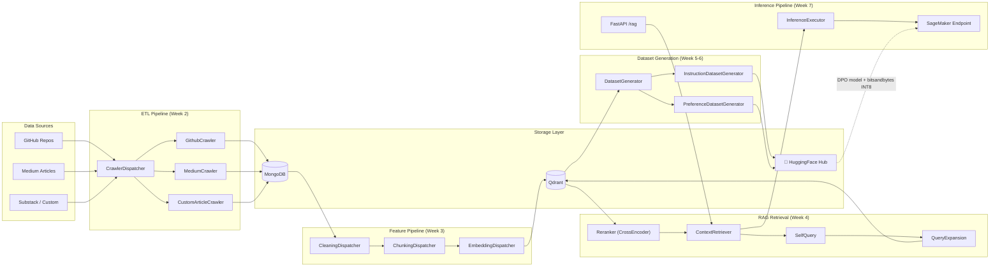
```mermaid
graph LR
    subgraph "Data Sources"
        GH["GitHub Repos"]
        MD["Medium Articles"]
        SS["Substack / Custom"]
    end

    subgraph "ETL Pipeline (Week 2)"
        D[CrawlerDispatcher]
        GC[GithubCrawler]
        MC[MediumCrawler]
        CC[CustomArticleCrawler]
    end

    subgraph "Feature Pipeline (Week 3)"
        Clean["CleaningDispatcher"]
        Chunk["ChunkingDispatcher"]
        Embed["EmbeddingDispatcher"]
    end

    subgraph "RAG Retrieval (Week 4)"
        CR["ContextRetriever"]
        SQ["SelfQuery"]
        QE["QueryExpansion"]
        RR["Reranker (CrossEncoder)"]
    end

    subgraph "Dataset Generation (Week 5-6)"
        DSG["DatasetGenerator"]
        IDG["InstructionDatasetGenerator"]
        PDG["PreferenceDatasetGenerator"]
    end

    subgraph "Inference Pipeline (Week 7)"
        API["FastAPI /rag"]
        IE["InferenceExecutor"]
        SM["SageMaker Endpoint"]
    end

    subgraph "Storage Layer"
        Mongo[(MongoDB)]
        Qdrant[(Qdrant)]
        HF["🤗 HuggingFace Hub"]
    end

    GH --> D
    MD --> D
    SS --> D
    D --> GC --> Mongo
    D --> MC --> Mongo
    D --> CC --> Mongo
    Mongo --> Clean --> Chunk --> Embed --> Qdrant
    CR --> SQ --> QE --> Qdrant
    Qdrant --> RR --> CR
    Qdrant --> DSG
    DSG --> IDG --> HF
    DSG --> PDG --> HF
    API --> CR
    CR --> IE --> SM
    HF -.->|"DPO model + bitsandbytes INT8"| SM
```

### Tech Stack
| Layer | Technology | Purpose |
|-------|------------|---------|
| Orchestration | **ZenML** | Pipeline DAGs, caching, artifact versioning |
| Raw Storage | **MongoDB** | Schemaless document store for crawled data |
| Vector Storage | **Qdrant** | ANN search with HNSW indexing (384-dim COSINE) |
| Embeddings | **all-MiniLM-L6-v2** | Sentence-level encoding (384 dimensions) |
| Language | **Python 3.11 + Poetry** | Reproducible dependency management |
| Containers | **Docker Compose** | Local MongoDB + Qdrant infrastructure |
| RAG LLM | **OpenAI gpt-4o-mini** | Query expansion, self-query, dataset generation, evaluation (via LangChain) |
| Fine-Tuning | **Unsloth + QLoRA** | Memory-efficient 4-bit Llama 3.1 8B fine-tuning |
| Training Infra | **AWS SageMaker** | Managed GPU training on `ml.g5.2xlarge` (NVIDIA A10G 24GB) |
| Experiment Tracking | **Comet ML** | Hyperparameter logging, loss curves, model registry |
| Inference API | **FastAPI + Uvicorn** | REST endpoint (`POST /rag`) for RAG inference |
| Inference Backend | **AWS SageMaker (Real-Time)** | HuggingFace TGI v2.4.0 container on `ml.g5.xlarge` |
| Quantization | **bitsandbytes INT8** | TGI-native quantization for 8B model on 24GB VRAM |
| Observability | **Opik (Comet ML)** | LLM call tracing with `@opik.track` decorator |
| Architecture | **DDD** | Domain-Driven Design with layered separation |

---

## 📂 Project Structure

```
moodSwarm/
├── llm_engineering/                    # Core DDD Package
│   ├── domain/                         # Data Models (Pure Python, no external deps)
│   │   ├── base/
│   │   │   ├── nosql.py                #   MongoDB ODM (CRUD, UUID handling)
│   │   │   └── vector.py              #   Qdrant ODM (bulk_insert, search, auto-collection)
│   │   ├── documents.py               #   UserDocument, ArticleDocument, RepositoryDocument, PostDocument
│   │   ├── cleaned_documents.py       #   CleanedArticleDocument, CleanedPostDocument, CleanedRepositoryDocument
│   │   ├── chunks.py                  #   ArticleChunk, PostChunk, RepositoryChunk
│   │   ├── embedded_chunks.py         #   EmbeddedArticleChunk, EmbeddedPostChunk, EmbeddedRepositoryChunk
│   │   ├── queries.py                 #   Query, EmbeddedQuery (RAG retrieval query models)
│   │   ├── types.py                   #   DataCategory enum (posts, articles, repositories, prompts, datasets...)
│   │   └── exceptions.py             #   LLMTwinException, ImproperlyConfigured
│   │
│   ├── application/                    # Business Logic
│   │   ├── crawlers/                  #   GithubCrawler, MediumCrawler, CustomArticleCrawler, CrawlerDispatcher
│   │   ├── preprocessing/             #   Cleaning / Chunking / Embedding handlers + dispatchers + factories
│   │   │   ├── dispatchers.py         #     CleaningDispatcher, ChunkingDispatcher, EmbeddingDispatcher
│   │   │   ├── cleaning_data_handlers.py
│   │   │   ├── chunking_data_handlers.py
│   │   │   ├── embedding_data_handlers.py
│   │   │   └── operations/            #     Low-level chunking + cleaning regex operations
│   │   ├── networks/                  #   EmbeddingModelSingleton, CrossEncoderModelSingleton
│   │   ├── rag/                       #   RAG retrieval pipeline (Week 4)
│   │   │   ├── base.py               #     PromptTemplateFactory (ABC), RAGStep (ABC, mock flag)
│   │   │   ├── prompt_templates.py   #     QueryExpansionTemplate, SelfQueryTemplate
│   │   │   ├── self_query.py         #     Author extraction via OpenAI → MongoDB lookup
│   │   │   ├── query_expansion.py    #     N query variants via OpenAI for multi-perspective search
│   │   │   ├── reranking.py          #     CrossEncoder re-ranker (ms-marco-MiniLM-L-4-v2)
│   │   │   └── retriever.py          #     ContextRetriever orchestrator (full RAG pipeline)
│   │   ├── dataset/                   #   Dataset generation (Week 5-6)
│   │   │   ├── generation.py         #     InstructionDatasetGenerator, PreferenceDatasetGenerator
│   │   │   ├── utils.py              #     Filtering, train/test split, near-dedup, contamination checks
│   │   │   ├── output_parsers.py     #     ListPydanticOutputParser for JSON → Pydantic
│   │   │   └── constants.py          #     Mock responses for testing
│   │   └── utils/                     #   split_user_full_name, batch()
│   │
│   ├── infrastructure/                 # External System Adapters
│   │   ├── opik_utils.py              #   Opik/Comet ML monitoring configuration
│   │   ├── inference_pipeline_api.py  #   FastAPI POST /rag endpoint (RAG → SageMaker inference)
│   │   ├── db/
│   │   │   ├── mongo.py               #   MongoDatabaseConnector (Singleton)
│   │   │   └── qdrant.py              #   QdrantDatabaseConnector (Singleton)
│   │   └── aws/deploy/                #   SageMaker endpoint deployment infrastructure
│   │       ├── config.py              #     HuggingFace TGI deploy config + ResourceRequirements
│   │       ├── sagemaker_huggingface.py  #  Strategy + Service deployment pattern
│   │       ├── run.py                 #     create_endpoint() orchestrator
│   │       └── delete_endpoint.py     #     Safe endpoint + config + model teardown
│   │
│   ├── model/                          # ML Model Code
│   │   ├── utils.py                   #   ResourceManager — SageMaker endpoint lifecycle checks
│   │   ├── finetuning/
│   │   │   ├── finetune.py            #   SFT/DPO entry point (Unsloth QLoRA, Alpaca format)
│   │   │   ├── sagemaker_launcher.py  #   SageMaker HuggingFace estimator launcher
│   │   │   └── requirements.txt       #   GPU-specific deps (torch, unsloth, transformers)
│   │   ├── inference/                  #   SageMaker real-time inference client
│   │   │   ├── inference.py           #     LLMInferenceSagemakerEndpoint (boto3 runtime)
│   │   │   └── run.py                 #     InferenceExecutor (RAG prompt → LLM → generated_text)
│   │   └── evaluation/
│   │       ├── evaluate.py            #   LLM-as-judge evaluation (accuracy + style scoring)
│   │       ├── sagemaker.py           #   SageMaker HuggingFaceProcessor launcher
│   │       └── requirements.txt       #   Evaluation deps (vLLM, OpenAI)
│   └── settings.py                     # Pydantic Settings (.env loader)
│
├── pipelines/                          # ZenML Pipeline Definitions
│   ├── smoke_test.py                  #   Verify MongoDB + Qdrant connectivity
│   ├── digital_data_etl.py            #   get_or_create_user → crawl_links
│   ├── feature_engineering.py         #   query_data_warehouse → clean → chunk_and_embed → load_to_vector_db
│   ├── generate_datasets.py           #   query_feature_store → create_prompts → generate → [push_to_hf]
│   ├── training.py                    #   SageMaker SFT/DPO training pipeline
│   └── evaluating.py                  #   SageMaker model evaluation pipeline
│
├── steps/                              # ZenML Step Implementations
│   ├── etl/
│   │   ├── get_or_create_user.py      #   User lookup/creation + metadata logging
│   │   └── crawl_links.py             #   Dispatcher-based crawling with retry + backoff
│   ├── feature_engineering/
│   │   ├── query_data_warehouse.py    #   Concurrent MongoDB fetch (ThreadPoolExecutor)
│   │   ├── clean.py                   #   CleaningDispatcher per document
│   │   ├── rag.py                     #   ChunkingDispatcher → EmbeddingDispatcher (batch=10)
│   │   └── load_to_vector_db.py       #   group_by_class → bulk_insert to Qdrant
│   ├── generate_datasets/
│   │   ├── query_feature_store.py     #   Fetch cleaned docs from Qdrant
│   │   ├── create_prompts.py          #   Document → prompt generation
│   │   ├── generate_instruction_dataset.py  #   SFT instruction-answer pairs
│   │   ├── generate_preference_dataset.py   #   DPO instruction-chosen-rejected triples
│   │   └── push_to_huggingface.py     #   Push dataset to HuggingFace Hub
│   ├── training/
│   │   └── train.py                   #   SageMaker training step
│   └── evaluating/
│       └── evaluate.py                #   SageMaker evaluation step
│
├── configs/                            # Pipeline Parameter Files
│   ├── digital_data_etl.yaml          #   User name + list of URLs to crawl
│   ├── feature_engineering.yaml       #   Author names for feature extraction
│   ├── generate_instruct_datasets.yaml  #   SFT dataset generation config
│   ├── generate_preference_datasets.yaml  #   DPO dataset generation config
│   ├── training.yaml                  #   SageMaker training config
│   └── evaluating.yaml               #   SageMaker evaluation config
│
├── tools/                              # CLI Utilities
│   ├── run.py                         #   Main CLI (--run-smoke-test | --run-etl | --run-feature-engineering | --run-generate-*)
│   ├── data_warehouse.py              #   MongoDB export/import (JSON backup/restore)
│   ├── qdrant_inspect.py             #   Qdrant CLI (list-collections, stats, sample, semantic search)
│   ├── chunk_analysis.py             #   Chunk validation (token distribution stats + PASS/FAIL limit check)
│   ├── search_test.py               #   End-to-end semantic search across all embedded collections
│   ├── rag.py                        #   Full RAG retrieval CLI (--query, --k, --mock)
│   ├── rag_tuning.py                #   Stage latency, parameter sweep, edge cases
│   ├── rag_eval.py                  #   Recall@K + MRR evaluation on curated test set
│   ├── dataset_inspect.py           #   Dataset stats, quality checks, LLM-as-judge eval, generation
│   ├── push_dataset.py              #   Push instruct/preference datasets to HuggingFace Hub
│   ├── sft_report.py               #   SFT training readiness checker
│   ├── model_compare.py            #   SFT vs DPO comparison CLI (LLM-as-judge evaluation)
│   ├── deploy_endpoint.py          #   SageMaker endpoint CLI (create / delete / status)
│   └── ml_service.py               #   FastAPI uvicorn launcher (port 8000)
│
├── interview/
│   └── INTERVIEW_QUESTIONS.md         #   41 interview Q&A derived from this codebase
│
├── docs/
│   ├── data_save_flow.html            #   Interactive visualization of the data save flow
│   └── week7_inference_deployment.md  #   Inference deployment config, cost analysis, commands
│
├── data/
│   ├── data_warehouse_raw_data/       #   Pre-crawled JSON data for offline import
│   ├── instruct_dataset_samples.json  #   Generated SFT instruction dataset
│   ├── instruct_evaluation.json       #   SFT LLM-as-judge evaluation results
│   ├── preference_dataset_samples.json  #   Generated DPO preference dataset
│   ├── preference_evaluation.json     #   DPO LLM-as-judge evaluation results
│   └── sft_vs_dpo_comparison.json     #   SFT vs DPO comparison results
├── docker-compose.yml                  #   MongoDB + Qdrant containers
└── pyproject.toml                      #   Poetry config + Poe tasks
```

---

## 📅 Engineering Journal

### ✅ Week 7: Inference Optimization & Deployment
**Objective:** Deploy the DPO-aligned model as a SageMaker real-time inference endpoint, build a FastAPI `/rag` endpoint that chains RAG retrieval with LLM generation, and add endpoint lifecycle management.

#### Inference Architecture
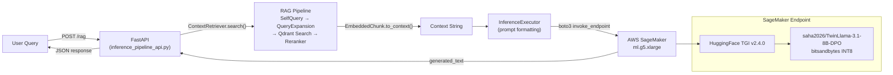
```mermaid
flowchart LR
    USER["User Query"] -->|"POST /rag"| API["FastAPI\n(inference_pipeline_api.py)"]
    API -->|"ContextRetriever.search()"| RAG["RAG Pipeline\nSelfQuery → QueryExpansion\n→ Qdrant Search → Reranker"]
    RAG -->|"EmbeddedChunk.to_context()"| CONTEXT["Context String"]
    CONTEXT --> IE["InferenceExecutor\n(prompt formatting)"]
    IE -->|"boto3 invoke_endpoint"| SM["AWS SageMaker\nml.g5.xlarge"]
    SM -->|"generated_text"| API
    API -->|"JSON response"| USER

    subgraph "SageMaker Endpoint"
        TGI["HuggingFace TGI v2.4.0"]
        MODEL["saha2026/TwinLlama-3.1-8B-DPO\nbitsandbytes INT8"]
        TGI --> MODEL
    end
    SM --> TGI
```

#### Deployment Configuration
| Parameter | Value | Purpose |
|-----------|-------|---------|
| Model | `saha2026/TwinLlama-3.1-8B-DPO` | DPO-aligned persona model |
| Instance Type | `ml.g5.xlarge` | 1× NVIDIA A10G (24GB VRAM), 4 vCPUs, 16GB RAM |
| Container | HuggingFace TGI v2.4.0 | Text Generation Inference server |
| Quantization | bitsandbytes INT8 | Fits 8B model in 24GB with headroom for KV cache |
| Max Input Length | 3,072 tokens | Sufficient for RAG context + query |
| Max Total Tokens | 4,096 tokens | Input + output combined limit |
| Max New Tokens | 150 | Generation limit per request |
| Temperature | 0.01 | Near-deterministic output |
| Top P | 0.9 | Nucleus sampling threshold |
| Prompt Template | Alpaca format | Model requires `### Instruction:` / `### Response:` wrapping |
| Health Check Timeout | 900s | Model loading + quantization time on cold start |

#### Inference Pipeline Components

**Domain ABCs** (`llm_engineering/domain/inference.py`):
- `Inference` — abstract base with `set_payload()` / `inference()` — strategy pattern for swappable inference backends
- `DeploymentStrategy` — abstract base with `deploy()` — decouples deployment logic from infrastructure

**SageMaker Client** (`llm_engineering/model/inference/inference.py`):
- `LLMInferenceSagemakerEndpoint(Inference)` — wraps boto3 `sagemaker-runtime` `invoke_endpoint`
- JSON payload with configurable `max_new_tokens`, `temperature`, `top_p`, `return_full_text`
- Supports optional `InferenceComponentName` for multi-model endpoints

**Inference Executor** (`llm_engineering/model/inference/run.py`):
- `InferenceExecutor` — takes LLM client + query + context
- Formats RAG prompt in **Alpaca template** (`### Instruction:` / `### Response:`) — critical: model produces zero tokens without this wrapper
- Includes fallback: if `return_full_text: False` returns empty, retries with `return_full_text: True` and strips input prefix
- Calls `llm.set_payload()` → `llm.inference()` → extracts `generated_text` from response

**Deploy Infrastructure** (`llm_engineering/infrastructure/aws/deploy/`):
- `SagemakerHuggingfaceStrategy(DeploymentStrategy)` — orchestrates the full deployment flow
- `DeploymentService` — creates `HuggingFaceModel` from image URI + env config, calls `.deploy()` with startup health check
- `config.py` — HuggingFace TGI environment variables + `ResourceRequirements` for GPU allocation
- `run.py` — `create_endpoint()` function: gets TGI image URI → creates ResourceManager → deploys via strategy
- `delete_endpoint.py` — safe teardown: deletes endpoint → endpoint config → model (in order, with error handling)

**ResourceManager** (`llm_engineering/model/utils.py`):
- boto3 SageMaker client for `endpoint_config_exists()` / `endpoint_exists()` checks
- Used during deployment to check for existing configurations

**FastAPI Endpoint** (`llm_engineering/infrastructure/inference_pipeline_api.py`):
- `POST /rag` — accepts `QueryRequest(query: str)`, returns `QueryResponse(answer: str)`
- `rag()` — orchestrates: `ContextRetriever.search(query, k=3)` → `EmbeddedChunk.to_context()` → `call_llm_service()`
- `call_llm_service()` — creates `LLMInferenceSagemakerEndpoint` → `InferenceExecutor.execute()`
- Both functions decorated with `@opik.track` for Comet ML monitoring

**Opik Monitoring** (`llm_engineering/infrastructure/opik_utils.py`):
- `configure_opik()` — sets up Comet ML workspace + API key for trace collection
- Each RAG request logs: `model_id`, `embedding_model_id`, `temperature`, query/context/answer token counts
- Tagged as `["rag"]` for filtering in Comet ML dashboard

#### CLI Tools

```bash
# Deploy endpoint (~5-15 min startup, ~$1.20/hr while running)
poetry run python -m tools.deploy_endpoint create

# Check endpoint status (Creating → InService → Failed)
poetry run python -m tools.deploy_endpoint status

# Start FastAPI server on port 8000
poetry run python -m tools.ml_service

# Test the RAG endpoint
curl -X POST http://localhost:8000/rag \
  -H "Content-Type: application/json" \
  -d '{"query": "How do RAG systems work?"}'

# CRITICAL: Delete endpoint when done (stops billing!)
poetry run python -m tools.deploy_endpoint delete
```

#### Deployment Issues Encountered
| # | Error | Fix |
|---|-------|-----|
| 1 | `ValueError: Must setup local AWS configuration with a region` | Created explicit `boto3.Session(region_name=...)` → passed `sagemaker_session` through deploy chain |
| 2 | `ResourceLimitExceeded` for ml.g5.2xlarge | Switched to `ml.g5.xlarge` (same GPU, had quota=1) |
| 3 | `ModelWrapper` tokenizer parse error | Upgraded TGI from v2.2.0 to v2.4.0 |
| 4 | CUDA OOM with `MAX_TOTAL_TOKENS=8192` | Reduced to `MAX_INPUT=3072`, `MAX_TOTAL=4096` |
| 5 | Empty `generated_text` (zero tokens) | Added Alpaca template wrapper to prompt |
| 6 | `ResourceNotFoundException` in `endpoint_exists()` | Changed to catch `ClientError` instead |

#### Cost Analysis
| Item | Cost | Notes |
|------|------|-------|
| Endpoint (running) | ~$1.20/hr | `ml.g5.xlarge` on-demand pricing |
| Per day (if left on) | ~$28.80/day | **Must delete when done** |
| Endpoint creation | Free | Pay only for instance uptime |
| Cold start | 5-15 minutes | Model download + quantization + health check |

#### End-to-End Test Results (2026-03-12)
| Step | Result |
|------|--------|
| Endpoint deploy | ~8 minutes cold start → `InService` |
| Query: "How do RAG systems work?" | 150-token answer about encoder-decoder architecture and attention mechanisms |
| Query: "What is supervised fine-tuning?" | Context-grounded answer referencing project content (Mistral, QLORA, Comet ML) |
| Endpoint teardown | Deleted endpoint + config + model in 2 seconds |
| Test cost | ~$0.20 (~10 minutes on ml.g5.xlarge @ $1.20/hr) |

#### Code Changes Summary
| File | Change |
|------|--------|
| `llm_engineering/settings.py` | Added 13 inference settings (endpoint names, token limits, generation params), updated `HF_MODEL_ID` to `saha2026/TwinLlama-3.1-8B-DPO` |
| `llm_engineering/application/utils/misc.py` | Added `compute_num_tokens()` using `AutoTokenizer` for Opik token tracking |
| `llm_engineering/domain/__init__.py` | Added `inference` module to domain exports |
| `llm_engineering/domain/inference.py` | **New** — ABC: `Inference`, `DeploymentStrategy` |
| `llm_engineering/model/utils.py` | **New** — `ResourceManager` for SageMaker endpoint lifecycle |
| `llm_engineering/model/inference/` | **New** — `LLMInferenceSagemakerEndpoint` + `InferenceExecutor` |
| `llm_engineering/infrastructure/opik_utils.py` | **New** — Opik/Comet ML monitoring configuration |
| `llm_engineering/infrastructure/inference_pipeline_api.py` | **New** — FastAPI `POST /rag` with Opik tracing |
| `llm_engineering/infrastructure/aws/deploy/` | **New** — Full SageMaker deployment infra (config, strategy, service, teardown) |
| `tools/deploy_endpoint.py` | **New** — CLI for create/delete/status endpoint management |
| `tools/ml_service.py` | **New** — FastAPI uvicorn launcher |
| `docs/week7_inference_deployment.md` | **New** — Deployment documentation |

---

### ✅ Week 5: SFT Fine-Tuning on AWS SageMaker
**Objective:** Fine-tune Meta Llama 3.1 8B using Supervised Fine-Tuning (SFT) with QLoRA on AWS SageMaker, producing a persona-aware writing assistant (TwinLlama).

#### Training Pipeline Architecture
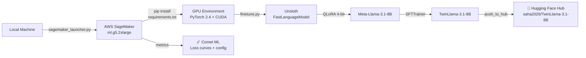
```mermaid
flowchart LR
    LOCAL["Local Machine"] -->|"sagemaker_launcher.py"| SM["AWS SageMaker\nml.g5.2xlarge"]
    SM -->|"pip install\nrequirements.txt"| ENV["GPU Environment\nPyTorch 2.4 + CUDA"]
    ENV -->|"finetune.py"| UNSLOTH["Unsloth\nFastLanguageModel"]
    UNSLOTH -->|"QLoRA 4-bit"| LLAMA["Meta-Llama-3.1-8B"]
    LLAMA -->|"SFTTrainer"| TRAINED["TwinLlama-3.1-8B"]
    TRAINED -->|"push_to_hub"| HF["🤗 Hugging Face Hub\nsaha2026/TwinLlama-3.1-8B"]
    SM -->|"metrics"| COMET["☄️ Comet ML\nLoss curves + config"]
```

#### Model & LoRA Configuration
| Parameter | Value | Rationale |
|-----------|-------|-----------|
| Base Model | `unsloth/Meta-Llama-3.1-8B` | Unsloth-optimized Llama 3.1 with pre-quantized weights |
| Architecture | `LlamaForCausalLM` | 32-layer decoder-only transformer |
| Hidden Size | 4096 | 32 attention heads, 8 KV heads (GQA) |
| Intermediate Size | 14,336 | SwiGLU activation (`silu`) |
| Vocab Size | 128,256 | Llama 3.1 extended vocabulary |
| Max Position Embeddings | 131,072 | RoPE with Llama3-style scaling (factor=8.0) |
| Quantization | 4-bit (QLoRA) | Memory-efficient training on 24GB VRAM |
| LoRA Rank (r) | 32 | Low-rank adaptation dimension |
| LoRA Alpha | 32 | Scaling factor (alpha/r = 1.0) |
| LoRA Dropout | 0.0 | No dropout for maximum signal |
| Target Modules | `q_proj`, `k_proj`, `v_proj`, `o_proj`, `gate_proj`, `up_proj`, `down_proj` | All attention + MLP projections (7 modules) |
| PEFT Type | `LORA` | Parameter-Efficient Fine-Tuning via LoRA |
| Precision | `bfloat16` | Native A10G support for mixed-precision training |

#### Training Hyperparameters
| Parameter | Value |
|-----------|-------|
| Epochs | 3 |
| Batch Size | 2 per device |
| Gradient Accumulation | 8 steps (effective batch = 16) |
| Learning Rate | 3e-4 |
| LR Schedule | Linear decay |
| Warmup Steps | 10 |
| Optimizer | `adamw_8bit` (memory-efficient) |
| Weight Decay | 0.01 |
| Max Sequence Length | 2,048 tokens |
| Packing | Enabled (multiple samples per sequence) |
| Logging | Every step → Comet ML |

#### Dataset Composition
| Dataset | Source | Samples | Purpose |
|---------|--------|---------|---------|
| `saha2026/llmtwin` | Custom instruction dataset | ~200 | Persona-specific writing samples generated from RAG context |
| `mlabonne/FineTome-Alpaca-100k` | Community Alpaca subset | 10,000 | General instruction-following capability |
| **Combined** | Concatenated + shuffled | ~10,200 | 95/5 train/test split |

All samples are formatted in **Alpaca template**:
```
Below is an instruction that describes a task. Write a response that appropriately completes the request.

### Instruction:
{instruction}

### Response:
{output}<|EOS|>
```

#### Training Results (Full Run)
| Metric | Value |
|--------|-------|
| Training Status | ✅ `SUCCESS` (exit code 0) |
| Dataset | 10,638 samples (638 `saha2026/llmtwin` + 10K `mlabonne/FineTome-Alpaca-100k`) |
| Training Steps | 399 steps, 3 epochs |
| Final Train Loss | **0.6494** |
| Loss Trajectory | 1.12 → 0.65 → 0.49 (epoch 1 → 2 → 3) |
| Training Time | 12,866 seconds (~3h 14m) |
| Billable Cost | ~$4.50 (ml.g5.2xlarge @ $1.515/hr) |
| Train Samples/sec | 0.549 |
| Instance Type | `ml.g5.2xlarge` (NVIDIA A10G 24GB) |
| Output Model | [`saha2026/TwinLlama-3.1-8B`](https://huggingface.co/saha2026/TwinLlama-3.1-8B) (merged 16-bit, pushed to HF Hub) |
| Experiment Tracking | Comet ML (full loss curves, config, source code uploaded) |

#### Dummy Run (Validation)
| Metric | Value |
|--------|-------|
| Dataset | 400 samples (subset) |
| Steps | 1 step, 1 epoch |
| Loss | 1.7142 |
| Training Time | 1,083 seconds (~18 minutes) |
| Purpose | Validate SageMaker pipeline end-to-end before full run |

#### SageMaker Infrastructure
- **Entry Point:** `finetune.py` — Unsloth QLoRA training script (SFT + DPO modes)
- **Launcher:** `sagemaker_launcher.py` — configures `HuggingFace` estimator with hyperparameters, requirements, and environment variables
- **Instance:** `ml.g5.2xlarge` — 1× NVIDIA A10G (24GB VRAM), 8 vCPUs, 32GB RAM
- **Base Image:** HuggingFace PyTorch 2.1 (py310), overridden by `requirements.txt` to PyTorch 2.4.0
- **Environment Variables:** `HUGGING_FACE_HUB_TOKEN`, `COMET_API_KEY`, `COMET_PROJECT_NAME`

#### Key Dependencies (requirements.txt)
```
accelerate==0.34.1      # HF training acceleration
torch==2.4.0            # PyTorch with CUDA support
transformers==4.45.2    # HF Transformers (supports Llama 3.1 tokenizer format)
unsloth==2024.9.post2   # Memory-efficient QLoRA fine-tuning
peft==0.12.0            # Parameter-Efficient Fine-Tuning
trl==0.9.6              # SFT/DPO trainers
bitsandbytes==0.43.3    # 4-bit quantization
comet-ml==3.44.3        # Experiment tracking
```

#### Dependency Resolution Challenges
Getting the right combination of Unsloth, Transformers, and PyTorch versions to work together on SageMaker required resolving several cascading compatibility issues:

| Issue | Root Cause | Fix |
|-------|-----------|-----|
| `ResourceLimitExceeded` | Zero quota for `ml.g5.2xlarge` | AWS Service Quotas increase request |
| `torchvision` mismatch | PyTorch 2.4.0 requires `torchvision>=0.19.0` | Pinned `torchvision==0.19.0` |
| `torch._inductor.config` crash | Unsloth HEAD imports `torchao` → needs PyTorch 2.6 | Reverted to `unsloth==2024.9.post2` |
| `ModelWrapper` safetensors error | `transformers==4.43.3` uses `tokenizers<0.20` which can't parse Llama 3.1 tokenizer | Upgraded to `transformers==4.45.2` |
| `PreTrainedConfig` NameError | API rename in newer Transformers breaks some Unsloth versions | Pinned to `transformers==4.45.2` (stable boundary) |
| Model not recognized by Unsloth | Hardcoded `meta-llama/Llama-3.1-8B` | Changed to `unsloth/Meta-Llama-3.1-8B` |

#### Comet ML Integration
All training metrics are automatically logged to Comet ML:
- **Hyperparameters:** Learning rate, batch size, epochs, LoRA config, model architecture
- **Training Curves:** Per-step loss, learning rate schedule
- **Model Config:** Full `LlamaConfig` with RoPE scaling, GQA heads, vocab size
- **Artifacts:** Conda environment, installed packages, source code, model graph
- **PEFT Config:** LoRA rank, alpha, target modules, dropout

---

### 🔄 Week 6 (Part 1): DPO Preference Dataset Generation
**Objective:** Generate preference alignment data (instruction, chosen, rejected triples) for Direct Preference Optimization training.

#### What is DPO Preference Data?
Each sample is a triple teaching the model to prefer one writing style over another:
- **instruction** — a question about a topic from the source documents
- **chosen** — a verbatim extract from original articles (author's blog-like writing style)
- **rejected** — an LLM-generated answer (GPT-style, more formal/generic)

This trains the model to prefer the author's casual tone over generic AI output.

#### Generation Pipeline

```mermaid
flowchart LR
    FS["Qdrant\ncleaned_* collections"] -->|"query_feature_store"| DOCS["7 Cleaned Documents"]
    DOCS -->|"extract_substrings()\n1000-2000 char chunks"| PROMPTS["142 Prompts"]
    PROMPTS -->|"GPT-4o-mini\nbatch=24"| RAW["590 Raw Samples\n(65 articles + 525 repos)"]
    RAW -->|"filter_short_answers()\nchosen ≥ 100 chars"| F1["Filter 1"]
    F1 -->|"filter_answer_format()\nuppercase + punctuation"| FINAL["80 Filtered Samples"]
    FINAL -->|"train_test_split()\n88.8% / 11.2%"| SPLIT["71 Train / 9 Test"]
    SPLIT -->|"push_to_hub()"| HF["🤗 saha2026/llmtwin-dpo"]
```

#### Dataset Statistics
| Metric | Value |
|--------|-------|
| Raw samples generated | 590 (65 articles + 525 repositories) |
| After filtering | 80 (86% rejection rate — strict format requirements on verbatim extracts) |
| Train / Test split | 71 / 9 (88.8% / 11.2%) |
| Instruction length | min=33, max=89, avg=54 chars |
| Chosen answer length | min=100, max=445, avg=151 chars |
| Generation cost | ~$0.04 (GPT-4o-mini, 109K input + 42K output tokens) |
| Generation time | 94.8s (0.7s per prompt) |

#### Quality Checks
| Check | Result |
|-------|--------|
| Empty fields | 0 |
| Short answers (<50 chars) | 0 |
| Duplicate instructions | 1 |
| Near-duplicates (Jaccard > 0.7) | 3 pairs |
| Train/test contamination (Jaccard > 0.8) | 0 |
| Keyword violations (context/extract/course) | 9 (cosmetic) |
| Format issues | 0 |

#### LLM-as-Judge Evaluation (20 samples)
| Metric | Score | Scale |
|--------|-------|-------|
| Accuracy | **2.00** avg | 1=poor, 2=good, 3=excellent |
| Style | **2.00** avg | 1=formal, 2=good, 3=excellent |
| Accuracy distribution | 1→2, 2→16, 3→2 | |
| Style distribution | 1→2, 2→16, 3→2 | |

#### HuggingFace Dataset
- **Repository:** [`saha2026/llmtwin-dpo`](https://huggingface.co/datasets/saha2026/llmtwin-dpo)
- **Columns:** `prompt`, `chosen`, `rejected` (standard DPO format)
- **Splits:** `train` (71 samples), `test` (9 samples)

#### Code Changes
- Updated `tools/push_dataset.py` — added `--dataset-type preference` flag for DPO-format push (`prompt/chosen/rejected` columns)

---

### ✅ Week 6 (Part 2): DPO Training + SFT vs DPO Evaluation
**Objective:** Train a DPO-aligned model on AWS SageMaker and compare SFT vs DPO quality.

#### DPO Training Pipeline
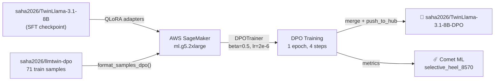
```mermaid
flowchart LR
    SFT["saha2026/TwinLlama-3.1-8B\n(SFT checkpoint)"] -->|"QLoRA adapters"| SM["AWS SageMaker\nml.g5.2xlarge"]
    DS["saha2026/llmtwin-dpo\n71 train samples"] -->|"format_samples_dpo()"| SM
    SM -->|"DPOTrainer\nbeta=0.5, lr=2e-6"| DPO["DPO Training\n1 epoch, 4 steps"]
    DPO -->|"merge + push_to_hub"| HF["🤗 saha2026/TwinLlama-3.1-8B-DPO"]
    DPO -->|"metrics"| COMET["☄️ Comet ML\nselective_heel_8570"]
```

#### DPO Training Configuration
| Parameter | Value |
|-----------|-------|
| Base Model | `saha2026/TwinLlama-3.1-8B` (SFT checkpoint) |
| DPO Beta | 0.5 |
| Learning Rate | 2e-6 (150x lower than SFT) |
| Epochs | 1 |
| Batch Size | 2 per device |
| Gradient Accumulation | 8 steps |
| Optimizer | `adamw_8bit` |
| Precision | `bfloat16` |
| QLoRA Rank | 32, alpha=32 |
| Target Modules | `q/k/v/o/gate/up/down_proj` (7 modules) |
| Max Sequence Length | 1024 (prompt) + 1024 (response) |
| Reference Model | `None` (online DPO — uses base model as implicit reference) |

#### Training Results
| Metric | Value |
|--------|-------|
| Training Status | SUCCESS (exit code 0) |
| Training Steps | 4 steps, 1 epoch |
| DPO Loss | 0.6931 → 0.7011 |
| Rewards Accuracy | 0.0 → 0.5 |
| Chosen Rewards | -0.009 → +0.004 |
| Rejected Rewards | -0.002 → +0.009 |
| Training Time | 27.2 seconds (compute only) |
| Wall Time | 23m 43s (incl. setup, deps, model upload) |
| Billable Cost | ~$0.60 (1324s on ml.g5.2xlarge @ $1.62/hr) |
| Output Model | [`saha2026/TwinLlama-3.1-8B-DPO`](https://huggingface.co/saha2026/TwinLlama-3.1-8B-DPO) |
| Comet ML | [`selective_heel_8570`](https://www.comet.com/sh-arka22/twin/a54c94dbc1284881a5f0317fbf28be8a) |

#### SFT vs DPO Comparison (LLM-as-Judge Proxy)
Since GPU inference isn't available locally, the comparison evaluates dataset answers as a proxy:

| Metric | SFT Baseline | DPO Chosen | DPO Rejected |
|--------|:------------:|:----------:|:------------:|
| Accuracy (avg) | 2.23 | 2.05 | 1.80 |
| Style (avg) | 2.12 | 1.95 | 1.85 |
| Samples | 65 | 20 | 20 |

**Key Findings:**
- Chosen > Rejected on style (+0.10) and accuracy (+0.25) — preference signal is valid for DPO
- SFT baseline scores higher than DPO chosen (expected — SFT dataset had higher-quality generated answers)
- DPO training teaches the model to move from rejected-style → chosen-style output

#### Inference Test (SageMaker)
**Prompt:** "Write a paragraph to introduce supervised fine-tuning."

**DPO Model Output:**
> Supervised fine-tuning is a method used to enhance the performance of a pre-trained machine learning model by adjusting its parameters based on a labeled dataset. In this approach, the model is initialized with weights obtained from a larger dataset, which provides a strong baseline for the task at hand. The fine-tuning process involves retraining the model on a smaller dataset, allowing it to adapt to the specific requirements of the new task. This approach can lead to significant improvements in accuracy and performance, as the model leverages its existing knowledge while refining its parameters to better fit the new data.

#### Bug Fixed
- `steps/training/train.py` imported `llm_engineering.model.finetuning.sagemaker` but actual file is `sagemaker_launcher.py` — fixed import path

#### Code Changes
- `configs/training.yaml` — switched to `finetuning_type: dpo`, `saha2026` workspace
- `tools/model_compare.py` — new SFT vs DPO comparison CLI
- `steps/training/train.py` — fixed import path for sagemaker launcher

---

### ✅ Week 4: RAG Retrieval & Inference
**Objective:** Advanced retrieval with query expansion, reranking, and a fully orchestrated retrieval pipeline.

**RAG Base Layer** (`llm_engineering/application/rag/`):
- `PromptTemplateFactory` (ABC) + `RAGStep` (ABC with `mock=True` flag for API-free testing)
- `QueryExpansionTemplate` — LangChain `PromptTemplate` generating N alternative queries separated by `#next-question#`
- `SelfQueryTemplate` — few-shot prompt to extract author name/ID from natural language queries

**Pre-Retrieval Optimizations:**
- `SelfQuery` — extracts author name via OpenAI `gpt-4o-mini` → `split_user_full_name()` → `UserDocument.get_or_create()` → enriches `Query.author_id` for filtered vector search
- `QueryExpansion` — generates N diverse query reformulations via OpenAI → splits by separator → returns `list[Query]` preserving original query ID and metadata
- Both use LangChain LCEL composition (`prompt | model`) with `ChatOpenAI(temperature=0)`
- Both support `mock=True` mode: SelfQuery returns query unchanged, QueryExpansion returns N identical copies

**Reranker** (`reranking.py`):
- `Reranker(RAGStep)` — uses `CrossEncoderModelSingleton` (`ms-marco-MiniLM-L-4-v2`) to score `(query, chunk)` pairs
- Sorts by relevance score descending → returns top-K chunks
- Supports `mock=True` mode (returns chunks unchanged)

**ContextRetriever** (`retriever.py`) — full orchestrator:
- `SelfQuery` → extract author metadata from query
- `QueryExpansion` → generate N query variants
- Parallel `ThreadPoolExecutor` search: embed each expanded query → search across `EmbeddedPostChunk`, `EmbeddedArticleChunk`, `EmbeddedRepositoryChunk` (k/3 per collection)
- Author-filtered vector search via Qdrant `FieldCondition(key="author_id", match=...)`
- Deduplication via `set()` (leverages `__eq__`/`__hash__` on UUID `id`)
- `Reranker` → cross-encoder re-ranking → final top-K results

**Tooling:**
- `tools/rag.py` — full RAG retrieval CLI (`--query`, `--k`, `--expand-to-n`, `--mock`)
- `tools/rag_tuning.py` — stage latency profiling, parameter sweep (k x expand_to_n), edge case tests
- `tools/rag_eval.py` — Recall@K + MRR evaluation on 7 curated query→expected-chunk test cases

**Baseline Metrics:**
| Metric | K=3 | K=6 |
|--------|-----|-----|
| Mean Recall@K | 0.429 | 0.595 |
| MRR | 1.000 | 0.857 |
| Avg Latency | 2567ms | 2472ms |

**Latency Profile:** OpenAI calls dominate (~3.2s combined for SelfQuery + QueryExpansion), Qdrant search ~16ms, CrossEncoder reranking ~276ms. Optimal defaults: `k=3`, `expand_to_n=3`.

**Dependencies Added:** `langchain-openai ^0.1.3` (ChatOpenAI), `opik ^0.2.2` (LLM observability via `@opik.track`)

### ✅ Week 3: RAG Feature Pipeline & Semantic Search
**Objective:** Transform raw text into searchable vectors in Qdrant, with end-to-end query capability.

**Feature Engineering Pipeline** (`feature_engineering`) with 4 ZenML steps:
1. `query_data_warehouse` — concurrent MongoDB fetch via `ThreadPoolExecutor`
2. `clean_documents` — regex normalization per data category
3. `chunk_and_embed` — type-specific splitting + SentenceTransformer encoding
4. `load_to_vector_db` — batched upsert into Qdrant (called twice: cleaned + embedded)

**Domain Models** — 11 classes across 4 transformation layers:
- **Cleaned:** `CleanedPostDocument`, `CleanedArticleDocument`, `CleanedRepositoryDocument`
- **Chunks:** `PostChunk`, `ArticleChunk`, `RepositoryChunk` (deterministic UUIDs via MD5)
- **Embedded:** `EmbeddedPostChunk`, `EmbeddedArticleChunk`, `EmbeddedRepositoryChunk` (384-dim vectors)
- **Queries:** `Query`, `EmbeddedQuery` — same embedding flow as chunks, enables RAG search

**Chunking Strategies (Two-Stage):**
- Posts: 250 tokens / 25 overlap → token-capped at 256
- Articles: 1000-2000 chars sentence-aware → token-capped at 256
- Repositories: 1500 tokens / 100 overlap → token-capped at 256

**Query & Search Layer:**
- `Query.from_str()` factory + `EmbeddedQuery` with 384-dim embedding
- `QueryEmbeddingHandler` added to `EmbeddingDispatcher` — same bi-encoder, same vector space as chunks
- `tools/search_test.py` — end-to-end CLI: query string → embed → search all collections → ranked results

**Validation & Tooling:**
- `tools/chunk_analysis.py` — token distribution analysis with PASS/FAIL limit checks
- `tools/qdrant_inspect.py` — collection listing, sampling, and semantic search CLI
- Idempotency verified: re-runs produce identical Qdrant counts
- All 26 chunks verified at or below 256 token limit

**Design Patterns:** Strategy (handlers), Factory (handler factories), Dispatcher (category routing), Singleton (embedding model), Open/Closed Principle (new QueryEmbeddingHandler without modifying existing handlers)

**Bugs Fixed:**
- `qdrant-client` API: `connection.search()` does not exist → replaced with `connection.query_points()`
- Article chunks exceeded 256 token limit (380-443 tokens) → added `SentenceTransformersTokenTextSplitter` as 2nd stage

**Final State:** `cleaned_articles` (3 points) + `embedded_articles` (26 points, 384-dim COSINE)

### ✅ Week 2: Digital Data ETL Pipeline
**Objective:** Automated data ingestion from the internet.

- **Pipeline:** `digital_data_etl` — `get_or_create_user` → `crawl_links`
- **Crawlers:** GitHub (git clone + file walk), Medium (Selenium), Custom (LangChain)
- **Routing:** `CrawlerDispatcher` with regex-based URL matching + fallback
- **Resilience:** Exponential backoff retries (tenacity), deduplication via `.find(link=link)`
- **Tooling:** `tools/data_warehouse.py` for MongoDB JSON backup/restore
- **Result:** 3 articles crawled for Paul Iusztin (14K + 8K + 7K chars), zero duplicates on re-run

### ✅ Week 1: Infrastructure Foundation
**Objective:** Reproducible MLOps environment.

- Docker Compose for MongoDB (27017) + Qdrant (6333)
- ZenML local stack initialization
- Pydantic Settings for `.env`-based configuration
- Smoke test pipeline for connectivity validation

---

## 🔍 Pipeline Deep Dives

### ETL Pipeline Sequence
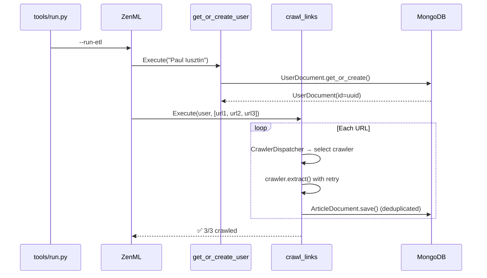
```mermaid
sequenceDiagram
    participant CLI as tools/run.py
    participant ZML as ZenML
    participant S1 as get_or_create_user
    participant S2 as crawl_links
    participant DB as MongoDB

    CLI->>ZML: --run-etl
    ZML->>S1: Execute("Paul Iusztin")
    S1->>DB: UserDocument.get_or_create()
    DB-->>S1: UserDocument(id=uuid)
    ZML->>S2: Execute(user, [url1, url2, url3])
    loop Each URL
        S2->>S2: CrawlerDispatcher → select crawler
        S2->>S2: crawler.extract() with retry
        S2->>DB: ArticleDocument.save() (deduplicated)
    end
    S2-->>ZML: ✅ 3/3 crawled
```

### Feature Engineering Pipeline
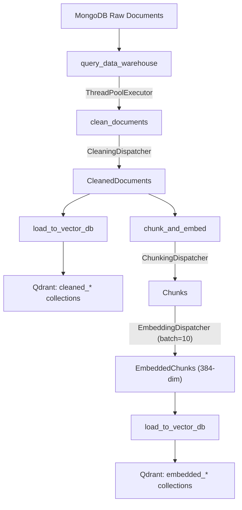
```mermaid
graph TD
    A[MongoDB Raw Documents] --> B[query_data_warehouse]
    B --> |ThreadPoolExecutor| C[clean_documents]
    C --> |CleaningDispatcher| D["CleanedDocuments"]
    D --> E1[load_to_vector_db]
    E1 --> F1["Qdrant: cleaned_* collections"]
    D --> G[chunk_and_embed]
    G --> |ChunkingDispatcher| H[Chunks]
    H --> |"EmbeddingDispatcher (batch=10)"| I["EmbeddedChunks (384-dim)"]
    I --> E2[load_to_vector_db]
    E2 --> F2["Qdrant: embedded_* collections"]
```

### Inference Pipeline (Week 7)
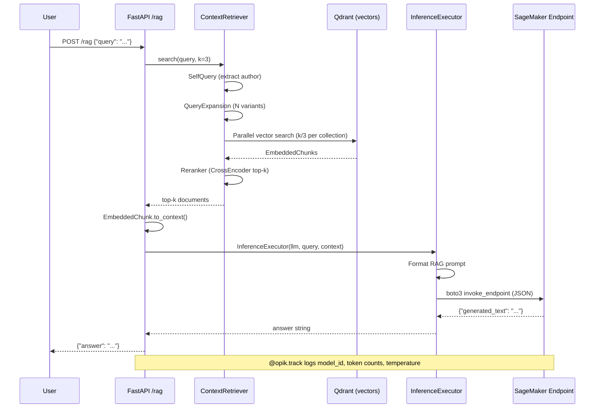
```mermaid
sequenceDiagram
    participant User
    participant API as FastAPI /rag
    participant RAG as ContextRetriever
    participant Qdrant as Qdrant (vectors)
    participant IE as InferenceExecutor
    participant SM as SageMaker Endpoint

    User->>API: POST /rag {"query": "..."}
    API->>RAG: search(query, k=3)
    RAG->>RAG: SelfQuery (extract author)
    RAG->>RAG: QueryExpansion (N variants)
    RAG->>Qdrant: Parallel vector search (k/3 per collection)
    Qdrant-->>RAG: EmbeddedChunks
    RAG->>RAG: Reranker (CrossEncoder top-k)
    RAG-->>API: top-k documents
    API->>API: EmbeddedChunk.to_context()
    API->>IE: InferenceExecutor(llm, query, context)
    IE->>IE: Format RAG prompt
    IE->>SM: boto3 invoke_endpoint (JSON)
    SM-->>IE: {"generated_text": "..."}
    IE-->>API: answer string
    API-->>User: {"answer": "..."}

    Note over API,SM: @opik.track logs model_id, token counts, temperature
```

---

## 🔀 End-to-End Data Flow: How Data is Saved & Transformed

> 📄 **Interactive version:** Open [`docs/data_save_flow.html`](docs/data_save_flow.html) in a browser for a styled, step-by-step visualization.

### Complete Data Lifecycle
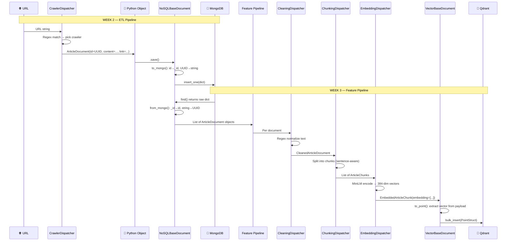
```mermaid
sequenceDiagram
    participant URL as 🌐 URL
    participant Crawler as CrawlerDispatcher
    participant PyObj as 🐍 Python Object
    participant ODM as NoSQLBaseDocument
    participant Mongo as 🍃 MongoDB
    participant FE as Feature Pipeline
    participant Clean as CleaningDispatcher
    participant Chunk as ChunkingDispatcher
    participant Embed as EmbeddingDispatcher
    participant VecODM as VectorBaseDocument
    participant Qdrant as 🔷 Qdrant

    Note over URL,Mongo: WEEK 2 — ETL Pipeline
    URL->>Crawler: URL string
    Crawler->>Crawler: Regex match → pick crawler
    Crawler->>PyObj: ArticleDocument(id=UUID, content=..., link=...)
    PyObj->>ODM: .save()
    ODM->>ODM: to_mongo(): id→_id, UUID→string
    ODM->>Mongo: insert_one(dict)

    Note over Mongo,Qdrant: WEEK 3 — Feature Pipeline
    Mongo->>ODM: find() returns raw dict
    ODM->>ODM: from_mongo(): _id→id, string→UUID
    ODM->>FE: List of ArticleDocument objects
    FE->>Clean: Per document
    Clean->>Clean: Regex normalize text
    Clean->>Chunk: CleanedArticleDocument
    Chunk->>Chunk: Split into chunks (sentence-aware)
    Chunk->>Embed: List of ArticleChunks
    Embed->>Embed: MiniLM encode → 384-dim vectors
    Embed->>VecODM: EmbeddedArticleChunk(embedding=[...])
    VecODM->>VecODM: to_point(): extract vector from payload
    VecODM->>Qdrant: bulk_insert(PointStruct)
```

### ODM Transformation: How Python ↔ Database Bridging Works

The project uses **two custom ODM layers** that transparently handle format conversion:

#### MongoDB ODM (`NoSQLBaseDocument`)
| Stage | `id` field | Key name | Type |
|-------|-----------|----------|------|
| **Python creation** | `UUID('a1b2c3d4-...')` | `id` | Python UUID object |
| **`to_mongo()`** | `'a1b2c3d4-...'` | `_id` | Plain string ← renamed |
| **MongoDB disk** | `'a1b2c3d4-...'` | `_id` | BSON string |
| **`from_mongo()`** | `'a1b2c3d4-...'` → `UUID(...)` | `id` | Pydantic coerces back |

```python
# SAVE: Python → MongoDB
def to_mongo(self) -> dict:
    data = self.model_dump()
    data['_id'] = str(data.pop('id'))   # UUID object → string, 'id' → '_id'
    return data

# LOAD: MongoDB → Python
def from_mongo(cls, data: dict):
    if '_id' in data:
        data['id'] = data.pop('_id')    # '_id' → 'id'
    return cls(**data)                   # Pydantic coerces string → UUID
```

#### Qdrant ODM (`VectorBaseDocument`)
| Stage | Key transformation | Purpose |
|-------|-------------------|---------|
| **`to_point()`** | Extract `embedding` from payload, convert `numpy` → `list` | Qdrant needs vectors separate from payload |
| **`from_record()`** | Merge `record.id` + `record.payload`, conditionally set `embedding` | Reconstruct full Python object from Qdrant record |

```python
# SAVE: Python → Qdrant
def to_point(self) -> PointStruct:
    data = self.model_dump()
    vector = data.pop("embedding", [])
    _id = str(data.pop("id"))
    return PointStruct(id=_id, vector=vector, payload=data)

# LOAD: Qdrant → Python
def from_record(cls, record) -> "VectorBaseDocument":
    payload = record.payload or {}
    payload["id"] = record.id
    if cls._has_class_attribute("embedding"):
        payload["embedding"] = record.vector
    return cls(**payload)
```

### Data Object Shapes at Each Stage

```
URL: "https://medium.com/@user/my-post"
                    │
                    ▼
┌─ ArticleDocument (Python) ──────────────────────────┐
│  id:        UUID('f9e8d7c6-...')                     │──── .save() → to_mongo()
│  platform:  "medium"                                 │
│  link:      "https://medium.com/@user/my-post"       │
│  content:   {"title": "...", "text": "..."}          │
│  author_id: UUID('a1b2c3d4-...')                     │
└──────────────────────────────────────────────────────┘
                    │
                    ▼
┌─ MongoDB Document (BSON on disk) ────────────────────┐
│  _id:       "f9e8d7c6-..."          ← UUID → string  │
│  platform:  "medium"                                  │
│  link:      "https://medium.com/..."                  │
│  content:   {"title": "...", "text": "..."}           │
│  author_id: "a1b2c3d4-..."          ← UUID → string  │
└───────────────────────────────────────────────────────┘
                    │
                    ▼  CleaningDispatcher
┌─ CleanedArticleDocument (Qdrant payload-only) ───────┐
│  id:        UUID(MD5(content))       ← deterministic  │
│  content:   "cleaned plain text..."  ← regex cleaned  │
│  platform:  "medium"                                  │
│  author_id: UUID('a1b2c3d4-...')                      │
└───────────────────────────────────────────────────────┘
                    │
                    ▼  ChunkingDispatcher (1000-2000 chars, sentence-aware)
┌─ ArticleChunk ───────────────────────────────────────┐
│  id:        UUID(MD5(chunk_content)) ← per-chunk ID   │
│  content:   "one paragraph chunk..."                  │
│  chunk_id:  0                                         │
│  metadata:  {chunk_size: 500, overlap: 50}            │
└───────────────────────────────────────────────────────┘
                    │
                    ▼  EmbeddingDispatcher (MiniLM, batch=10)
┌─ EmbeddedArticleChunk ──────────────────────────────┐
│  id:        UUID(MD5(chunk_content))                  │
│  content:   "one paragraph chunk..."                  │
│  embedding: [0.023, -0.156, ..., 0.089]  ← 384 floats│──── .to_point()
│  metadata:  {model: "all-MiniLM-L6-v2", dim: 384}   │
└──────────────────────────────────────────────────────┘
                    │
                    ▼
┌─ Qdrant PointStruct ─────────────────────────────────┐
│  id:      "f9e8d7c6-..."                              │
│  vector:  [0.023, -0.156, ..., 0.089]  ← separate    │
│  payload: {content: "...", platform: "medium", ...}   │
└───────────────────────────────────────────────────────┘
```

---

## 🧩 Architecture Deep Dive — Code-Level Flowcharts

> Detailed walkthroughs of every layer with Mermaid diagrams and code snippets.

### Domain Model Class Hierarchy


```mermaid
classDiagram
    class NoSQLBaseDocument {
        <<abstract>>
        +UUID4 id
        +from_mongo(data) T
        +to_mongo() dict
        +save() T
        +get_or_create() T
        +bulk_insert(docs) bool
        +find() T
        +bulk_find() list~T~
    }

    class VectorBaseDocument {
        <<abstract>>
        +UUID4 id
        +from_record(point) T
        +to_point() PointStruct
        +bulk_insert(docs) bool
        +bulk_find(limit) tuple
        +search(query_vector) list~T~
        +create_collection() bool
        +group_by_class(docs) dict
    }

    class UserDocument {
        +str first_name
        +str last_name
        +full_name property
    }

    class Document {
        <<abstract>>
        +dict content
        +str platform
        +UUID4 author_id
        +str author_full_name
    }

    class PostDocument { +str image; +str link }
    class ArticleDocument { +str link }
    class RepositoryDocument { +str name; +str link }

    class CleanedDocument {
        <<abstract>>
        +str content
        +str platform
        +UUID4 author_id
    }
    class CleanedPostDocument { +str image }
    class CleanedArticleDocument { +str link }
    class CleanedRepositoryDocument { +str name; +str link }

    class Chunk {
        <<abstract>>
        +str content
        +UUID4 document_id
        +dict metadata
    }
    class PostChunk { +str image }
    class ArticleChunk { +str link }
    class RepositoryChunk { +str name; +str link }

    class EmbeddedChunk {
        <<abstract>>
        +list~float~ embedding
        +to_context(chunks) str
    }
    class EmbeddedPostChunk
    class EmbeddedArticleChunk { +str link }
    class EmbeddedRepositoryChunk { +str name; +str link }

    class Query {
        +str content
        +from_str(query) Query
        +replace_content(new) Query
    }
    class EmbeddedQuery { +list~float~ embedding }

    NoSQLBaseDocument <|-- UserDocument
    NoSQLBaseDocument <|-- Document
    Document <|-- PostDocument
    Document <|-- ArticleDocument
    Document <|-- RepositoryDocument

    VectorBaseDocument <|-- CleanedDocument
    CleanedDocument <|-- CleanedPostDocument
    CleanedDocument <|-- CleanedArticleDocument
    CleanedDocument <|-- CleanedRepositoryDocument

    VectorBaseDocument <|-- Chunk
    Chunk <|-- PostChunk
    Chunk <|-- ArticleChunk
    Chunk <|-- RepositoryChunk

    VectorBaseDocument <|-- EmbeddedChunk
    EmbeddedChunk <|-- EmbeddedPostChunk
    EmbeddedChunk <|-- EmbeddedArticleChunk
    EmbeddedChunk <|-- EmbeddedRepositoryChunk

    VectorBaseDocument <|-- Query
    Query <|-- EmbeddedQuery
```

#### Data Storage Mapping

| Domain Model | Storage | Collection Name | Has Vectors? |
|---|---|---|---|
| `UserDocument` | MongoDB | `users` | — |
| `PostDocument` | MongoDB | `posts` | — |
| `ArticleDocument` | MongoDB | `articles` | — |
| `RepositoryDocument` | MongoDB | `repositories` | — |
| `CleanedPostDocument` | Qdrant | `cleaned_posts` | ❌ payload-only |
| `CleanedArticleDocument` | Qdrant | `cleaned_articles` | ❌ payload-only |
| `CleanedRepositoryDocument` | Qdrant | `cleaned_repositories` | ❌ payload-only |
| `EmbeddedPostChunk` | Qdrant | `embedded_posts` | ✅ 384-dim cosine |
| `EmbeddedArticleChunk` | Qdrant | `embedded_articles` | ✅ 384-dim cosine |
| `EmbeddedRepositoryChunk` | Qdrant | `embedded_repositories` | ✅ 384-dim cosine |
| `Query` / `EmbeddedQuery` | Qdrant | `queries` | ✅ 384-dim cosine |

---

### Infrastructure — Singleton Database Connectors

Both connectors use the **Singleton Pattern** to reuse a single client across the entire application.

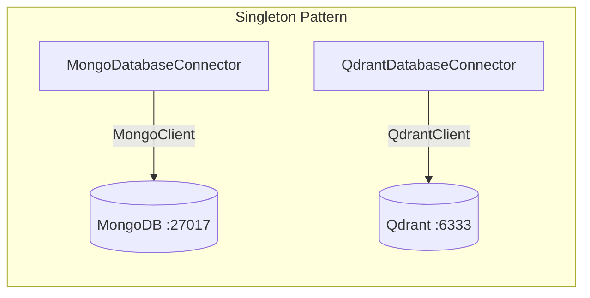
```mermaid
graph LR
    subgraph Singleton["Singleton Pattern"]
        MC["MongoDatabaseConnector"] -->|MongoClient| MONGO[("MongoDB :27017")]
        QC["QdrantDatabaseConnector"] -->|QdrantClient| QDRANT[("Qdrant :6333")]
    end
```

```python
# MongoDB (llm_engineering/infrastructure/db/mongo.py)
class MongoDatabaseConnector:
    _instance: MongoClient | None = None
    def __new__(cls) -> MongoClient:
        if cls._instance is None:
            cls._instance = MongoClient(settings.DATABASE_HOST)
        return cls._instance

# Qdrant (llm_engineering/infrastructure/db/qdrant.py)
class QdrantDatabaseConnector:
    _instance: QdrantClient | None = None
    def __new__(cls) -> QdrantClient:
        if cls._instance is None:
            if settings.USE_QDRANT_CLOUD:
                cls._instance = QdrantClient(url=settings.QDRANT_CLOUD_URL, api_key=settings.QDRANT_APIKEY)
            else:
                cls._instance = QdrantClient(host=settings.QDRANT_DATABASE_HOST, port=settings.QDRANT_DATABASE_PORT)
        return cls._instance
```

---

### ETL Crawling — Dispatcher Routing & Extraction

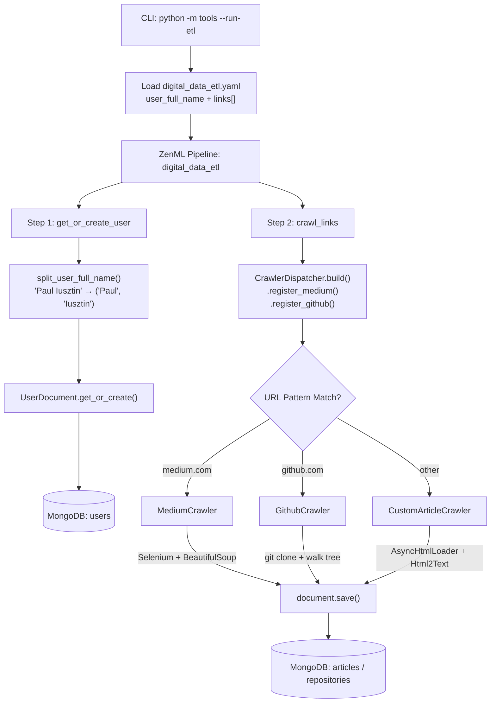
```mermaid
flowchart TD
    START["CLI: python -m tools --run-etl"] --> CONFIG["Load digital_data_etl.yaml<br/>user_full_name + links[]"]
    CONFIG --> P["ZenML Pipeline: digital_data_etl"]
    P --> S1["Step 1: get_or_create_user"]
    P --> S2["Step 2: crawl_links"]

    S1 --> SPLIT["split_user_full_name()<br/>'Paul Iusztin' → ('Paul', 'Iusztin')"]
    SPLIT --> UPSERT["UserDocument.get_or_create()"]
    UPSERT --> MONGO_USER[("MongoDB: users")]

    S2 --> DISPATCH["CrawlerDispatcher.build()<br/>.register_medium()<br/>.register_github()"]
    DISPATCH --> MATCH{URL Pattern Match?}
    MATCH -->|"medium.com"| MEDIUM["MediumCrawler"]
    MATCH -->|"github.com"| GITHUB["GithubCrawler"]
    MATCH -->|"other"| CUSTOM["CustomArticleCrawler"]

    MEDIUM -->|"Selenium + BeautifulSoup"| SAVE
    GITHUB -->|"git clone + walk tree"| SAVE
    CUSTOM -->|"AsyncHtmlLoader + Html2Text"| SAVE
    SAVE["document.save()"] --> MONGO_DOCS[("MongoDB: articles / repositories")]
```

```python
# Crawler Dispatcher — regex-based URL routing (application/crawlers/dispatcher.py)
class CrawlerDispatcher:
    def register(self, domain: str, crawler: type[BaseCrawler]) -> None:
        parsed = urlparse(domain)
        self._crawlers[r"https://(www\.)?{}/*".format(re.escape(parsed.netloc))] = crawler

    def get_crawler(self, url: str) -> BaseCrawler:
        for pattern, crawler in self._crawlers.items():
            if re.match(pattern, url):
                return crawler()
        return CustomArticleCrawler()  # Fallback for unknown domains

# MediumCrawler — Selenium headless + BeautifulSoup (application/crawlers/medium.py)
class MediumCrawler(BaseSeleniumCrawler):
    model = ArticleDocument
    def extract(self, link, **kwargs):
        self.driver.get(link)
        self.scroll_page()
        soup = BeautifulSoup(self.driver.page_source, "html.parser")
        data = {"Title": ..., "Subtitle": ..., "Content": soup.get_text()}
        self.model(content=data, platform="medium", link=link, ...).save()

# GithubCrawler — git clone + file tree walk (application/crawlers/github.py)
class GithubCrawler(BaseCrawler):
    model = RepositoryDocument
    def extract(self, link, **kwargs):
        subprocess.run(["git", "clone", link], cwd=temp_dir)
        tree = {filepath: content for filepath, content in walk_files(repo_path)}
        self.model(content=tree, name=repo_name, platform="github", ...).save()
```

> **Deduplication:** Every crawler checks `self.model.find(link=link)` before extracting — no duplicate documents.

---

### Feature Engineering — Clean → Chunk → Embed

#### Cleaning Pipeline (Factory + Strategy)

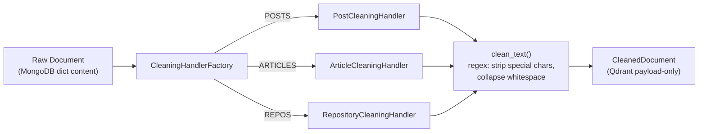
```mermaid
flowchart LR
    RAW["Raw Document<br/>(MongoDB dict content)"]
    RAW --> FACTORY["CleaningHandlerFactory"]
    FACTORY -->|POSTS| PCH["PostCleaningHandler"]
    FACTORY -->|ARTICLES| ACH["ArticleCleaningHandler"]
    FACTORY -->|REPOS| RCH["RepositoryCleaningHandler"]
    PCH & ACH & RCH --> CLEAN_OP["clean_text()<br/>regex: strip special chars,<br/>collapse whitespace"]
    CLEAN_OP --> CLEANED["CleanedDocument<br/>(Qdrant payload-only)"]
```

```python
# Cleaning Operation (application/preprocessing/operations/cleaning.py)
def clean_text(text: str) -> str:
    text = re.sub(r"[^\w\s.,!?]", " ", text)   # Strip special characters
    text = re.sub(r"\s+", " ", text)             # Collapse whitespace
    return text.strip()

# Factory creates the right handler per DataCategory
class CleaningDispatcher:
    @classmethod
    def dispatch(cls, data_model: NoSQLBaseDocument) -> VectorBaseDocument:
        data_category = DataCategory(data_model.get_collection_name())
        handler = cls.factory.create_handler(data_category)
        return handler.clean(data_model)
```

#### Chunking Pipeline (Two-Stage Strategy)

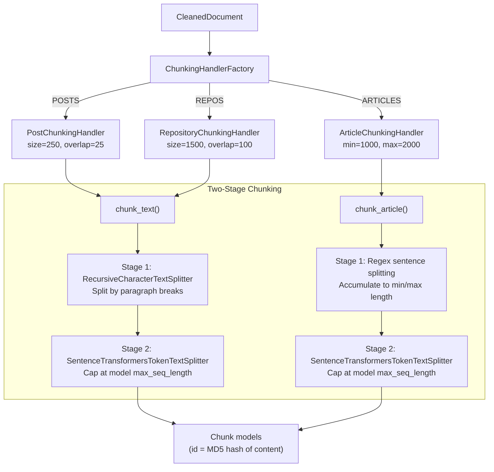
```mermaid
flowchart TD
    CLEANED["CleanedDocument"] --> CFACTORY["ChunkingHandlerFactory"]
    CFACTORY -->|POSTS| PC["PostChunkingHandler<br/>size=250, overlap=25"]
    CFACTORY -->|ARTICLES| AC["ArticleChunkingHandler<br/>min=1000, max=2000"]
    CFACTORY -->|REPOS| RC["RepositoryChunkingHandler<br/>size=1500, overlap=100"]

    PC & RC --> CT["chunk_text()"]
    AC --> CA["chunk_article()"]

    subgraph TwoStage["Two-Stage Chunking"]
        CT --> S1C["Stage 1: RecursiveCharacterTextSplitter<br/>Split by paragraph breaks"]
        S1C --> S2C["Stage 2: SentenceTransformersTokenTextSplitter<br/>Cap at model max_seq_length"]

        CA --> S1A["Stage 1: Regex sentence splitting<br/>Accumulate to min/max length"]
        S1A --> S2A["Stage 2: SentenceTransformersTokenTextSplitter<br/>Cap at model max_seq_length"]
    end

    S2C & S2A --> CHUNKS["Chunk models<br/>(id = MD5 hash of content)"]
```

```python
# Posts/Repos chunking (application/preprocessing/operations/chunking.py)
def chunk_text(text, chunk_size=500, chunk_overlap=50):
    # Stage 1: character-level splitting by paragraph
    character_splitter = RecursiveCharacterTextSplitter(
        separators=["\n\n"], chunk_size=chunk_size, chunk_overlap=0)
    text_split = character_splitter.split_text(text)

    # Stage 2: token-level capping at embedding model's max
    token_splitter = SentenceTransformersTokenTextSplitter(
        chunk_overlap=chunk_overlap,
        tokens_per_chunk=embedding_model.max_input_length,
        model_name=embedding_model.model_id)
    return [chunk for section in text_split for chunk in token_splitter.split_text(section)]

# Articles chunking — sentence-aware with min/max bounds
def chunk_article(text, min_length, max_length):
    sentences = re.split(r"(?<!\w\.\w.)(?<![A-Z][a-z]\.)(<=\.|\?|\!)\s", text)
    extracts = []  # accumulate sentences until max_length, flush at min_length
    # ... then Stage 2: SentenceTransformersTokenTextSplitter caps each extract
```

> **Deterministic IDs:** `UUID(hashlib.md5(chunk.encode()).hexdigest(), version=4)` — identical content always gets the same ID (dedup via upsert).

#### Embedding Pipeline

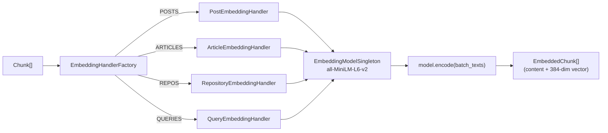
```mermaid
flowchart LR
    CHUNKS["Chunk[]"] --> EDFACTORY["EmbeddingHandlerFactory"]
    EDFACTORY -->|POSTS| PEH["PostEmbeddingHandler"]
    EDFACTORY -->|ARTICLES| AEH["ArticleEmbeddingHandler"]
    EDFACTORY -->|REPOS| REH["RepositoryEmbeddingHandler"]
    EDFACTORY -->|QUERIES| QEH["QueryEmbeddingHandler"]

    PEH & AEH & REH & QEH --> MODEL["EmbeddingModelSingleton<br/>all-MiniLM-L6-v2"]
    MODEL --> EMBED["model.encode(batch_texts)"]
    EMBED --> EMBEDDED["EmbeddedChunk[]<br/>(content + 384-dim vector)"]
```

```python
# Singleton embedding model (application/networks/embeddings.py)
class EmbeddingModelSingleton(metaclass=SingletonMeta):
    def __init__(self, model_id=settings.TEXT_EMBEDDING_MODEL_ID):
        self._model = SentenceTransformer(model_id, device=settings.RAG_MODEL_DEVICE)
        self._model.eval()

    def __call__(self, input_text, to_list=True):
        embeddings = self._model.encode(input_text)
        return embeddings.tolist() if to_list else embeddings

    @cached_property
    def embedding_size(self) -> int:
        return self._model.encode("").shape[0]  # 384

# Cross-Encoder for reranking (wired into ContextRetriever via Reranker)
class CrossEncoderModelSingleton(metaclass=SingletonMeta):
    def __init__(self, model_id=settings.RERANKING_CROSS_ENCODER_MODEL_ID):
        self._model = CrossEncoder(model_name=model_id, device=settings.RAG_MODEL_DEVICE)
    def __call__(self, pairs: list[tuple[str, str]]) -> list[float]:
        return self._model.predict(pairs).tolist()
```

---

### RAG Retrieval Pipeline — Full ContextRetriever Orchestration

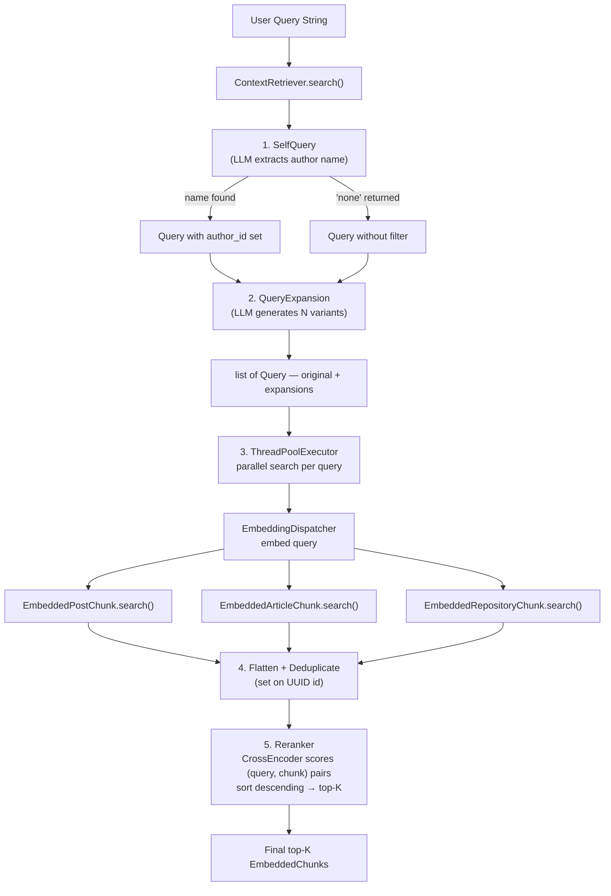
```mermaid
flowchart TD
    Q_INPUT["User Query String"]
    Q_INPUT --> CTX["ContextRetriever.search()"]
    CTX --> SELF_QUERY["1. SelfQuery<br/>(LLM extracts author name)"]
    SELF_QUERY -->|"name found"| ANNOTATED["Query with author_id set"]
    SELF_QUERY -->|"'none' returned"| PLAIN["Query without filter"]

    ANNOTATED & PLAIN --> EXPANSION["2. QueryExpansion<br/>(LLM generates N variants)"]
    EXPANSION --> Q_LIST["list of Query — original + expansions"]

    Q_LIST --> PARALLEL["3. ThreadPoolExecutor<br/>parallel search per query"]
    PARALLEL --> EMBED_Q["EmbeddingDispatcher<br/>embed query"]
    EMBED_Q --> SEARCH_P["EmbeddedPostChunk.search()"]
    EMBED_Q --> SEARCH_A["EmbeddedArticleChunk.search()"]
    EMBED_Q --> SEARCH_R["EmbeddedRepositoryChunk.search()"]

    SEARCH_P & SEARCH_A & SEARCH_R --> DEDUP["4. Flatten + Deduplicate<br/>(set on UUID id)"]
    DEDUP --> RERANK["5. Reranker<br/>CrossEncoder scores (query, chunk) pairs<br/>sort descending → top-K"]
    RERANK --> RESULTS["Final top-K EmbeddedChunks"]
```

```python
# ContextRetriever — full RAG orchestrator (application/rag/retriever.py)
class ContextRetriever:
    def __init__(self, mock=False):
        self._query_expander = QueryExpansion(mock=mock)
        self._metadata_extractor = SelfQuery(mock=mock)
        self._reranker = Reranker(mock=mock)

    def search(self, query: str, k: int = 3, expand_to_n_queries: int = 3) -> list:
        query_model = Query.from_str(query)
        query_model = self._metadata_extractor.generate(query_model)       # 1. Extract author
        n_queries = self._query_expander.generate(query_model, expand_to_n=expand_to_n_queries)  # 2. Expand

        with ThreadPoolExecutor() as executor:                              # 3. Parallel search
            tasks = [executor.submit(self._search, q, k) for q in n_queries]
            n_k_docs = flatten([t.result() for t in as_completed(tasks)])
            n_k_docs = list(set(n_k_docs))                                   # 4. Dedup

        return self.rerank(query, chunks=n_k_docs, keep_top_k=k) if n_k_docs else []  # 5. Rerank

    def _search(self, query: Query, k: int = 3) -> list[EmbeddedChunk]:
        embedded_query = EmbeddingDispatcher.dispatch(query)
        query_filter = Filter(must=[FieldCondition(key="author_id", ...)]) if embedded_query.author_id else None
        # Search across all 3 embedded collections (k/3 each)
        return EmbeddedPostChunk.search(...) + EmbeddedArticleChunk.search(...) + EmbeddedRepositoryChunk.search(...)

# Reranker — CrossEncoder re-ranking (application/rag/reranking.py)
class Reranker(RAGStep):
    def __init__(self, mock=False):
        self._model = CrossEncoderModelSingleton()  # ms-marco-MiniLM-L-4-v2

    def generate(self, query: Query, chunks: list[EmbeddedChunk], keep_top_k: int) -> list[EmbeddedChunk]:
        if self._mock: return chunks
        scores = self._model([(query.content, chunk.content) for chunk in chunks])
        scored = sorted(zip(scores, chunks), key=lambda x: x[0], reverse=True)
        return [doc for _, doc in scored[:keep_top_k]]
```

---

### Complete End-to-End Data Flow

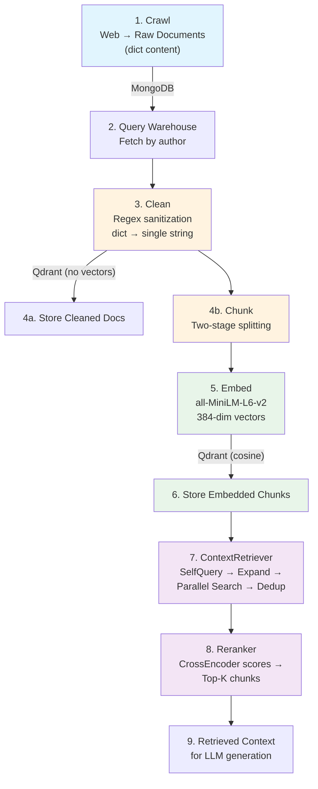
```mermaid
flowchart TD
    A["1. Crawl<br/>Web → Raw Documents<br/>(dict content)"] -->|"MongoDB"| B["2. Query Warehouse<br/>Fetch by author"]
    B --> C["3. Clean<br/>Regex sanitization<br/>dict → single string"]
    C -->|"Qdrant (no vectors)"| D["4a. Store Cleaned Docs"]
    C --> E["4b. Chunk<br/>Two-stage splitting"]
    E --> F["5. Embed<br/>all-MiniLM-L6-v2<br/>384-dim vectors"]
    F -->|"Qdrant (cosine)"| G["6. Store Embedded Chunks"]
    G --> H["7. ContextRetriever<br/>SelfQuery → Expand →<br/>Parallel Search → Dedup"]
    H --> I["8. Reranker<br/>CrossEncoder scores →<br/>Top-K chunks"]
    I --> J["9. Retrieved Context<br/>for LLM generation"]

    style A fill:#e1f5fe
    style C fill:#fff3e0
    style E fill:#fff3e0
    style F fill:#e8f5e9
    style G fill:#e8f5e9
    style H fill:#f3e5f5
    style I fill:#f3e5f5
```

---

### Design Patterns Summary

| Pattern | Where Used | Purpose |
|---|---|---|
| **Singleton** | `MongoDatabaseConnector`, `QdrantDatabaseConnector`, `EmbeddingModelSingleton`, `CrossEncoderModelSingleton` | One instance per process |
| **Factory** | `CleaningHandlerFactory`, `ChunkingHandlerFactory`, `EmbeddingHandlerFactory` | Create handler by `DataCategory` |
| **Strategy** | All `*DataHandler` classes (cleaning, chunking, embedding) | Interchangeable processing per content type |
| **Dispatcher** | `CrawlerDispatcher`, `CleaningDispatcher`, `ChunkingDispatcher`, `EmbeddingDispatcher` | Route data to correct handler |
| **Template Method** | `BaseCrawler.extract()`, `RAGStep.generate()` | Abstract method in base, concrete in subclasses |
| **Active Record** | `NoSQLBaseDocument.save()`, `VectorBaseDocument.bulk_insert()` | Domain objects manage own persistence |
| **Builder** | `CrawlerDispatcher.build().register_medium().register_github()` | Fluent chaining for setup |

---

## 🚀 How to Run

### 1. Start Infrastructure
```bash
docker-compose up -d
```

### 2. Run Pipelines
```bash
# Connectivity check
poetry run python -m tools.run --run-smoke-test

# Crawl data from the internet → MongoDB
poetry run python -m tools.run --run-etl --no-cache

# Clean → Chunk → Embed → Qdrant
poetry run python -m tools.run --run-feature-engineering --no-cache
```

### 3. Inspect Vector Store
```bash
# List all Qdrant collections
poetry run python -m tools.qdrant_inspect list-collections

# View sample points
poetry run python -m tools.qdrant_inspect sample embedded_articles --limit 3

# Semantic search (via qdrant_inspect)
poetry run python -m tools.qdrant_inspect search embedded_articles --query "machine learning deployment"
```

### 3b. End-to-End Semantic Search
```bash
# Search across ALL embedded collections at once
poetry run python -m tools.search_test --query "machine learning deployment"

# Custom number of results per collection
poetry run python -m tools.search_test --query "data pipelines" --k 5
```

### 4. Validate Chunk Quality
```bash
# Analyze token distributions across all embedded_* collections
poetry run python -m tools.chunk_analysis

# Check a specific collection
poetry run python -m tools.chunk_analysis --collection embedded_articles
```

### 5. RAG Retrieval Pipeline
```bash
# Full RAG retrieval (SelfQuery → QueryExpansion → Search → Rerank)
poetry run python -m tools.rag -q "How do RAG systems work?" --k 3

# With author-filtered search
poetry run python -m tools.rag -q "My name is Arkajyoti Saha. Write about LLMs." --k 9

# Mock mode (no OpenAI API calls)
poetry run python -m tools.rag -q "What are best practices?" --mock

# Parameter tuning suite
poetry run python -m tools.rag_tuning

# Evaluation baselines (Recall@K + MRR)
poetry run python -m tools.rag_eval --k 3
poetry run python -m tools.rag_eval --k 6
```

### 6. Dataset Generation & Inspection
```bash
# Generate instruction dataset (SFT) — uses OpenAI API
poetry run python -m tools.run --run-generate-instruct-datasets --no-cache

# Generate preference dataset (DPO) — uses OpenAI API
poetry run python -m tools.run --run-generate-preference-datasets --no-cache

# Or generate via standalone tool (saves to data/ JSON)
poetry run python -m tools.dataset_inspect generate --type preference
poetry run python -m tools.dataset_inspect generate --type instruct --mock  # Free mock mode

# Inspect dataset
poetry run python -m tools.dataset_inspect stats --type preference
poetry run python -m tools.dataset_inspect samples --type preference --n 5
poetry run python -m tools.dataset_inspect quality --type preference --deep

# LLM-as-judge evaluation (uses OpenAI API, ~$0.005 for 20 samples)
poetry run python -m tools.dataset_inspect evaluate --type preference --n 20

# Push to HuggingFace
poetry run python -m tools.push_dataset \
  --dataset-path data/preference_dataset_samples.json \
  --dataset-id saha2026/llmtwin-dpo \
  --dataset-type preference

# Dry run (preview without pushing)
poetry run python -m tools.push_dataset \
  --dataset-path data/instruct_dataset_samples.json \
  --dataset-id saha2026/llmtwin \
  --dry-run
```

### 7. Data Backup/Restore
```bash
# Export MongoDB → JSON
poetry run python -m tools.data_warehouse --export-raw-data

# Import JSON → MongoDB
poetry run python -m tools.data_warehouse --import-raw-data
```

### 8. Fine-Tune LLM on SageMaker
```bash
# Launch SFT fine-tuning on AWS SageMaker (requires AWS credentials in .env)
poetry run python -m llm_engineering.model.finetuning.sagemaker_launcher

# The job runs remotely on ml.g5.2xlarge — monitor via:
# - Terminal output (streams CloudWatch logs)
# - Comet ML dashboard (real-time loss curves)
# - AWS SageMaker Console (job status)
```

### 9. Monitoring
```bash
poetry run zenml login --local
```

---

## 🎓 Interview Preparation

A comprehensive set of **45 interview questions** derived directly from this codebase is available at [`interview/INTERVIEW_QUESTIONS.md`](interview/INTERVIEW_QUESTIONS.md). Topics covered:
- System Architecture & FTI Design
- Data Engineering & ETL Patterns
- Feature Pipeline (Clean → Chunk → Embed)
- Domain Modeling & ODM Patterns
- Embeddings & NLP Theory
- Vector Databases & Similarity Search
- Software Design Patterns (Strategy, Factory, Dispatcher, Singleton)
- MLOps & Pipeline Orchestration
- RAG Retrieval & Query Embedding
- Model Training (QLoRA, SFT, DPO)
- Mathematical Foundations
- Testing & Validation (chunk quality gates)
