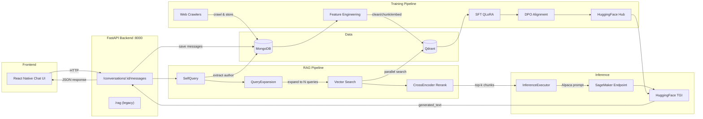
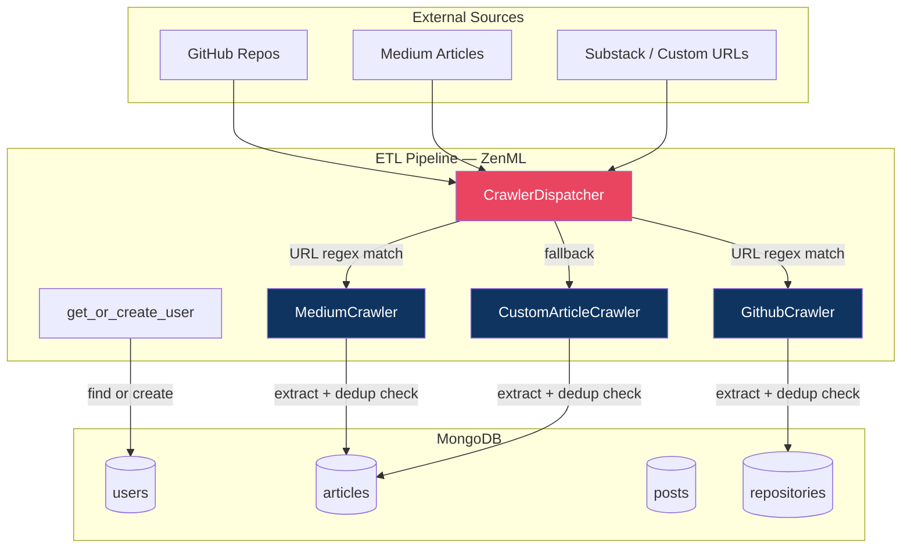
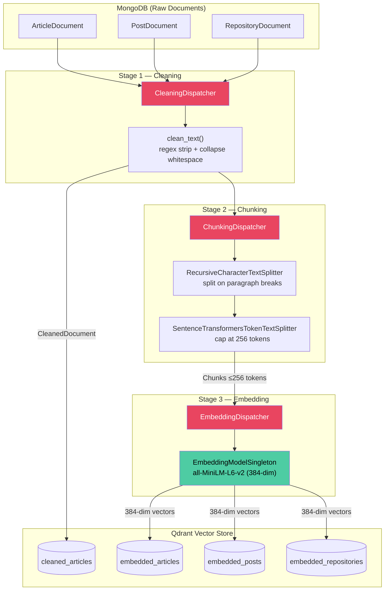
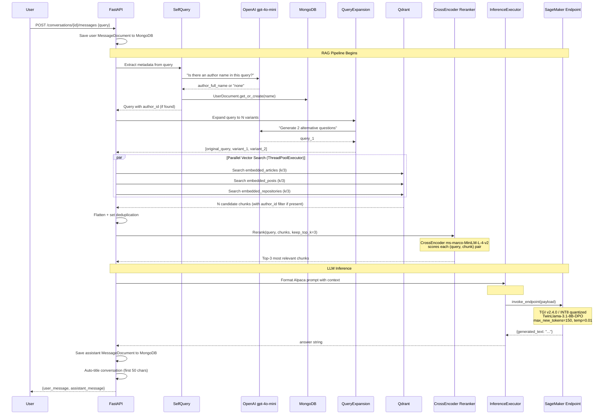
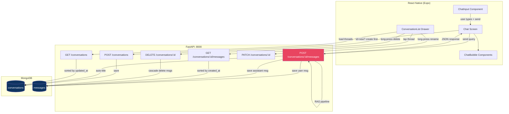
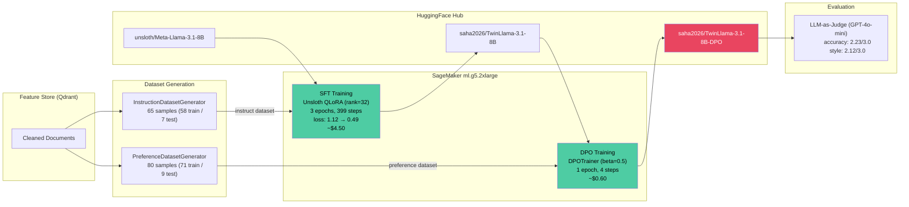
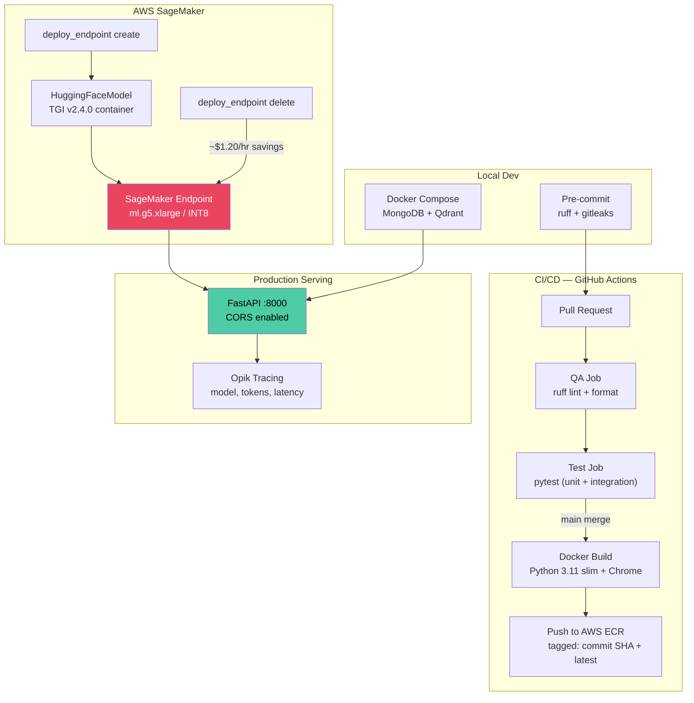

# MoodSwarm

An end-to-end LLM Twin platform that learns a persona's writing style from their content (articles, repos, posts), then generates responses in that style via a RAG-powered chat interface.

Built with the **Feature-Training-Inference (FTI)** pipeline architecture following *The LLM Engineer's Handbook*.

## Architecture

### End-to-End System


```mermaid
graph LR
    subgraph Frontend
        UI[React Native Chat UI]
    end

    subgraph Backend["FastAPI Backend :8000"]
        API["/conversations/:id/messages"]
        RAG_EP["/rag (legacy)"]
    end

    subgraph RAG["RAG Pipeline"]
        SQ[SelfQuery]
        QE[QueryExpansion]
        VS[Vector Search]
        RR[CrossEncoder Rerank]
    end

    subgraph Inference
        IE[InferenceExecutor]
        SM[SageMaker Endpoint]
        TGI[HuggingFace TGI]
    end

    subgraph Data
        MDB[(MongoDB)]
        QDB[(Qdrant)]
    end

    subgraph Training["Training Pipeline"]
        ETL[Web Crawlers]
        FE[Feature Engineering]
        SFT[SFT QLoRA]
        DPO[DPO Alignment]
        HF[HuggingFace Hub]
    end

    UI -->|HTTP| API
    API --> SQ
    SQ -->|extract author| MDB
    SQ --> QE
    QE -->|expand to N queries| VS
    VS -->|parallel search| QDB
    VS --> RR
    RR -->|top-k chunks| IE
    IE -->|Alpaca prompt| SM
    SM --> TGI
    TGI -->|generated_text| API
    API -->|save messages| MDB
    API -->|JSON response| UI

    ETL -->|crawl & store| MDB
    MDB --> FE
    FE -->|clean/chunk/embed| QDB
    QDB --> SFT
    SFT --> DPO
    DPO --> HF
    HF --> TGI
```

### Data Ingestion Pipeline (ETL)


```mermaid
graph TD
    subgraph Sources["External Sources"]
        GH[GitHub Repos]
        MD[Medium Articles]
        SS[Substack / Custom URLs]
    end

    subgraph ETL["ETL Pipeline — ZenML"]
        U[get_or_create_user]
        CD[CrawlerDispatcher]
        GC[GithubCrawler]
        MC[MediumCrawler]
        CC[CustomArticleCrawler]
    end

    subgraph Storage["MongoDB"]
        UD[(users)]
        AD[(articles)]
        PD[(posts)]
        RD[(repositories)]
    end

    U -->|find or create| UD
    GH --> CD
    MD --> CD
    SS --> CD
    CD -->|URL regex match| GC
    CD -->|URL regex match| MC
    CD -->|fallback| CC
    GC -->|extract + dedup check| RD
    MC -->|extract + dedup check| AD
    CC -->|extract + dedup check| AD

    style CD fill:#e94560,color:#fff
    style GC fill:#0f3460,color:#fff
    style MC fill:#0f3460,color:#fff
    style CC fill:#0f3460,color:#fff
```

> Each crawler checks `model.find(link=link)` before scraping — reruns skip existing docs. `tenacity` provides 3 retries with exponential backoff.

### Feature Engineering Pipeline


```mermaid
graph TD
    subgraph Input["MongoDB (Raw Documents)"]
        A[ArticleDocument]
        P[PostDocument]
        R[RepositoryDocument]
    end

    subgraph Clean["Stage 1 — Cleaning"]
        CD1[CleaningDispatcher]
        CT["clean_text()
        regex strip + collapse whitespace"]
    end

    subgraph Chunk["Stage 2 — Chunking"]
        CHD[ChunkingDispatcher]
        S1["RecursiveCharacterTextSplitter
        split on paragraph breaks"]
        S2["SentenceTransformersTokenTextSplitter
        cap at 256 tokens"]
    end

    subgraph Embed["Stage 3 — Embedding"]
        ED[EmbeddingDispatcher]
        EM["EmbeddingModelSingleton
        all-MiniLM-L6-v2 (384-dim)"]
    end

    subgraph Output["Qdrant Vector Store"]
        CA[(cleaned_articles)]
        EA[(embedded_articles)]
        EP[(embedded_posts)]
        ER[(embedded_repositories)]
    end

    A --> CD1
    P --> CD1
    R --> CD1
    CD1 --> CT
    CT -->|CleanedDocument| CA
    CT --> CHD
    CHD --> S1
    S1 --> S2
    S2 -->|Chunks ≤256 tokens| ED
    ED --> EM
    EM -->|384-dim vectors| EA
    EM -->|384-dim vectors| EP
    EM -->|384-dim vectors| ER

    style CD1 fill:#e94560,color:#fff
    style CHD fill:#e94560,color:#fff
    style ED fill:#e94560,color:#fff
    style EM fill:#4ecca3,color:#000
```

> Deterministic chunk IDs via `UUID(MD5(content))` enable idempotent Qdrant upserts. Chunking is type-specific: articles use sentence-aware splitting (1000-2000 chars), posts use 250 tokens / 25 overlap, repos use 1500 tokens / 100 overlap.

### RAG Retrieval Pipeline (Per Query)


```mermaid
sequenceDiagram
    participant User
    participant API as FastAPI
    participant SQ as SelfQuery
    participant OpenAI as OpenAI gpt-4o-mini
    participant MongoDB
    participant QE as QueryExpansion
    participant Qdrant
    participant RR as CrossEncoder Reranker
    participant IE as InferenceExecutor
    participant SM as SageMaker Endpoint

    User->>API: POST /conversations/{id}/messages {query}
    API->>API: Save user MessageDocument to MongoDB

    Note over API,SM: RAG Pipeline Begins

    API->>SQ: Extract metadata from query
    SQ->>OpenAI: "Is there an author name in this query?"
    OpenAI-->>SQ: author_full_name or "none"
    SQ->>MongoDB: UserDocument.get_or_create(name)
    SQ-->>API: Query with author_id (if found)

    API->>QE: Expand query to N variants
    QE->>OpenAI: "Generate 2 alternative questions"
    OpenAI-->>QE: query_1 #next-question# query_2
    QE-->>API: [original_query, variant_1, variant_2]

    par Parallel Vector Search (ThreadPoolExecutor)
        API->>Qdrant: Search embedded_articles (k/3)
        API->>Qdrant: Search embedded_posts (k/3)
        API->>Qdrant: Search embedded_repositories (k/3)
    end
    Qdrant-->>API: N candidate chunks (with author_id filter if present)

    API->>API: Flatten + set deduplication

    API->>RR: Rerank(query, chunks, keep_top_k=3)
    Note over RR: CrossEncoder ms-marco-MiniLM-L-4-v2<br/>scores each (query, chunk) pair
    RR-->>API: Top-3 most relevant chunks

    Note over API,SM: LLM Inference

    API->>IE: Format Alpaca prompt with context
    Note over IE: ### Instruction:<br/>User query: {query}<br/>Context: {chunks}<br/>### Response:
    IE->>SM: invoke_endpoint(payload)
    Note over SM: TGI v2.4.0 / INT8 quantized<br/>TwinLlama-3.1-8B-DPO<br/>max_new_tokens=150, temp=0.01
    SM-->>IE: {generated_text: "..."}
    IE-->>API: answer string

    API->>API: Save assistant MessageDocument to MongoDB
    API->>API: Auto-title conversation (first 50 chars)
    API-->>User: {user_message, assistant_message}
```

### Chat Message Flow


```mermaid
graph TD
    subgraph Client["React Native (Expo)"]
        CS[Chat Screen]
        CL[ConversationList Drawer]
        CI[ChatInput Component]
        CB[ChatBubble Components]
    end

    subgraph API["FastAPI :8000"]
        CC[POST /conversations]
        LC[GET /conversations]
        SM_EP[POST /conversations/:id/messages]
        GM[GET /conversations/:id/messages]
        RC[PATCH /conversations/:id]
        DC[DELETE /conversations/:id]
    end

    subgraph DB["MongoDB"]
        CONV[(conversations)]
        MSG[(messages)]
    end

    CI -->|"user types + send"| CS
    CS -->|"id=new? create first"| CC
    CC -->|save| CONV
    CS -->|"send query"| SM_EP
    SM_EP -->|"save user msg"| MSG
    SM_EP -->|"RAG pipeline"| SM_EP
    SM_EP -->|"save assistant msg"| MSG
    SM_EP -->|"auto-title"| CONV
    SM_EP -->|"JSON response"| CS
    CS --> CB

    CL -->|"load threads"| LC
    LC -->|"sorted by updated_at"| CONV
    CL -->|"tap thread"| GM
    GM -->|"sorted by created_at"| MSG
    CL -->|"long-press rename"| RC
    CL -->|"long-press delete"| DC
    DC -->|"cascade delete msgs"| MSG

    style SM_EP fill:#e94560,color:#fff
    style CONV fill:#0f3460,color:#fff
    style MSG fill:#0f3460,color:#fff
```

### Model Training Pipeline


```mermaid
graph LR
    subgraph Data["Feature Store (Qdrant)"]
        CL[Cleaned Documents]
    end

    subgraph DatasetGen["Dataset Generation"]
        IG["InstructionDatasetGenerator
        65 samples (58 train / 7 test)"]
        PG["PreferenceDatasetGenerator
        80 samples (71 train / 9 test)"]
    end

    subgraph Training["SageMaker ml.g5.2xlarge"]
        SFT["SFT Training
        Unsloth QLoRA (rank=32)
        3 epochs, 399 steps
        loss: 1.12 → 0.49
        ~$4.50"]
        DPO_T["DPO Training
        DPOTrainer (beta=0.5)
        1 epoch, 4 steps
        ~$0.60"]
    end

    subgraph Models["HuggingFace Hub"]
        BASE["unsloth/Meta-Llama-3.1-8B"]
        SFT_M["saha2026/TwinLlama-3.1-8B"]
        DPO_M["saha2026/TwinLlama-3.1-8B-DPO"]
    end

    subgraph Eval["Evaluation"]
        JUDGE["LLM-as-Judge (GPT-4o-mini)
        accuracy: 2.23/3.0
        style: 2.12/3.0"]
    end

    CL --> IG
    CL --> PG
    IG -->|instruct dataset| SFT
    BASE --> SFT
    SFT --> SFT_M
    PG -->|preference dataset| DPO_T
    SFT_M --> DPO_T
    DPO_T --> DPO_M
    DPO_M --> JUDGE

    style SFT fill:#4ecca3,color:#000
    style DPO_T fill:#4ecca3,color:#000
    style DPO_M fill:#e94560,color:#fff
```

### Deployment & Infrastructure


```mermaid
graph TD
    subgraph CI_CD["CI/CD — GitHub Actions"]
        PR[Pull Request]
        QA["QA Job
        ruff lint + format"]
        TEST["Test Job
        pytest (unit + integration)"]
        BUILD["Docker Build
        Python 3.11 slim + Chrome"]
        PUSH["Push to AWS ECR
        tagged: commit SHA + latest"]
    end

    subgraph Deploy["AWS SageMaker"]
        EP_CREATE["deploy_endpoint create"]
        HF_MODEL["HuggingFaceModel
        TGI v2.4.0 container"]
        EP["SageMaker Endpoint
        ml.g5.xlarge / INT8"]
        EP_DELETE["deploy_endpoint delete"]
    end

    subgraph Serve["Production Serving"]
        FAST["FastAPI :8000
        CORS enabled"]
        OPIK["Opik Tracing
        model, tokens, latency"]
    end

    subgraph Local["Local Dev"]
        DOCKER["Docker Compose
        MongoDB + Qdrant"]
        HOOKS["Pre-commit
        ruff + gitleaks"]
    end

    PR --> QA
    QA --> TEST
    TEST -->|"main merge"| BUILD
    BUILD --> PUSH

    EP_CREATE --> HF_MODEL
    HF_MODEL --> EP
    EP --> FAST
    FAST --> OPIK
    EP_DELETE -->|"~$1.20/hr savings"| EP

    HOOKS --> PR
    DOCKER --> FAST

    style EP fill:#e94560,color:#fff
    style FAST fill:#4ecca3,color:#000
```

## Quick Start

### Prerequisites

- Python 3.11 (via pyenv), Poetry 1.8+, Docker, Node.js 18+
- AWS account (SageMaker), OpenAI API key, HuggingFace token

### 1. Environment

```bash
git clone https://github.com/sh-arka22/moodSwarm.git && cd moodSwarm
pyenv local 3.11.8
poetry install
cp .env.example .env  # Fill in API keys
```

### 2. Start infrastructure

```bash
docker compose up -d              # MongoDB + Qdrant
poetry run zenml init             # Initialize ZenML
```

### 3. Run data pipelines

```bash
# Crawl content and store in MongoDB
poetry run python -m tools.run --run-etl --no-cache

# Clean, chunk, embed and store in Qdrant
poetry run python -m tools.run --run-feature-engineering --no-cache
```

### 4. Deploy LLM endpoint

```bash
poetry run python -m tools.deploy_endpoint create    # ~5-10 min, ~$1.20/hr
poetry run python -m tools.deploy_endpoint status     # Wait for "InService"
```

### 5. Launch the app

```bash
# Terminal 1 — Backend
poetry run python -m tools.ml_service                 # FastAPI on :8000

# Terminal 2 — Frontend
cd frontend && npm install
npx expo start                                        # Press 'w' for web
```

### 6. Clean up

```bash
poetry run python -m tools.deploy_endpoint delete     # Stop billing
docker compose down                                   # Stop local services
```

## Tech Stack

### Frontend

| Category | Technology | Version | Purpose |
|----------|-----------|---------|---------|
| Framework | React Native | 0.83.2 | Cross-platform mobile/web UI |
| Runtime | Expo | 55.0.6 | Build toolchain, dev server, managed workflow |
| Routing | expo-router | 55.0.5 | File-based routing (app directory) |
| Navigation | @react-navigation/drawer | 7.9.4 | Side drawer for conversation threads |
| Animations | react-native-reanimated | 4.2.1 | Gesture-driven drawer animations |
| Gestures | react-native-gesture-handler | 2.30.0 | Touch handling for swipes, long-press |
| Safe Area | react-native-safe-area-context | 5.6.2 | Notch/status bar inset handling |
| Screens | react-native-screens | 4.23.0 | Native screen containers for navigation |
| Web | react-native-web | 0.21.0 | Web platform support |
| Language | TypeScript | 5.9.2 | Type-safe frontend code |
| UI Library | React | 19.2.0 | Component rendering engine |

### Backend

| Category | Technology | Version | Purpose |
|----------|-----------|---------|---------|
| **API & Server** | | | |
| Web Framework | FastAPI | via Starlette | REST API with async support |
| Validation | Pydantic / pydantic-settings | 2.x | Request/response models, env config |
| Server | Uvicorn | via ZenML | ASGI server with hot reload |
| **Data Stores** | | | |
| Document DB | MongoDB | latest (Docker) | Raw documents, conversations, messages |
| MongoDB Driver | PyMongo | 4.6.2 | Python MongoDB client |
| Vector DB | Qdrant | latest (Docker) | Embeddings storage + similarity search |
| Qdrant Client | qdrant-client | 1.8.0 | Python Qdrant client |
| **ML / NLP** | | | |
| Embeddings | sentence-transformers | 3.0.0 | all-MiniLM-L6-v2 (384-dim vectors) |
| Reranking | cross-encoder | via sentence-transformers | ms-marco-MiniLM-L-4-v2 |
| Tokenization | tiktoken | 0.12.0 | Token counting for prompts |
| Transformers | HuggingFace transformers | 4.40.0 | Model loading, tokenizer utils |
| Tensor Ops | PyTorch | >=2.0.0, <2.3.0 | Embedding model inference |
| NumPy | numpy | 1.26.0 | Array operations |
| **RAG Pipeline** | | | |
| LLM Client | langchain-openai | 0.1.3 | OpenAI GPT-4o-mini for query expansion & self-query |
| Text Splitting | langchain-text-splitters | 0.2.0 | RecursiveCharacterTextSplitter |
| Community | langchain-community | 0.2.11 | CustomArticleCrawler HTML extraction |
| **Fine-Tuning** | | | |
| Training Library | Unsloth | (SageMaker) | QLoRA SFT + DPO on Llama 3.1 8B |
| Dataset Mgmt | HuggingFace datasets | 4.6.1 | Dataset loading, train/test splits |
| Hub | huggingface-hub | >=0.20.0 | Model & dataset push/pull |
| ML Utils | scikit-learn | 1.8.0 | Train/test splitting |
| **Inference & Deploy** | | | |
| Cloud ML | AWS SageMaker | via boto3 | Model endpoint hosting (ml.g5.xlarge) |
| Serving | HuggingFace TGI | v2.4.0 | Text Generation Inference container |
| Quantization | bitsandbytes | (SageMaker) | INT8 model quantization |
| AWS SDK | boto3 / sagemaker | <3.0.0 | Endpoint create/invoke/delete |
| **Web Crawling** | | | |
| Browser Automation | Selenium | 4.21.0 | Dynamic page rendering |
| Driver Mgmt | webdriver-manager | 4.0.1 | ChromeDriver auto-install |
| HTML Parsing | BeautifulSoup4 | 4.12.3 | HTML → text extraction |
| Markdown | html2text | 2024.2.26 | HTML → Markdown conversion |
| Retry Logic | tenacity | 8.x | Exponential backoff for crawlers |
| **Orchestration** | | | |
| Pipeline Engine | ZenML | 0.74.0 | ML pipeline orchestration |
| Config | PyYAML | 6.0 | Pipeline YAML configs |
| Task Runner | poethepoet | 0.29.0 | CLI task definitions |
| CLI | Click | 8.0.1 | Command-line interfaces |
| **Monitoring & Quality** | | | |
| Tracing | Opik (Comet ML) | 0.2.2 | LLM call tracing, token/latency logging |
| Logging | Loguru | 0.7.2 | Structured logging |
| Linting | Ruff | 0.4.9 | Python lint + format |
| Testing | pytest | 8.2.2 | Unit + integration tests |
| Pre-commit | pre-commit | 3.7.1 | Git hooks (ruff + gitleaks) |
| Secret Scanning | gitleaks | (pre-commit) | Prevent credential leaks |
| **CI/CD** | | | |
| CI | GitHub Actions | - | Lint + test on PRs |
| CD | GitHub Actions | - | Docker build + push to ECR on main |
| Containers | Docker | multi-stage | Python 3.11 slim production image |
| Registry | AWS ECR | - | Container image storage |

## API Endpoints

| Method | Path | Description |
|--------|------|-------------|
| `POST` | `/rag` | One-shot RAG query (legacy) |
| `POST` | `/conversations` | Create conversation thread |
| `GET` | `/conversations` | List all threads |
| `PATCH` | `/conversations/{id}` | Rename thread |
| `DELETE` | `/conversations/{id}` | Delete thread + messages |
| `GET` | `/conversations/{id}/messages` | Get message history |
| `POST` | `/conversations/{id}/messages` | Send message, get RAG response |

## Project Structure

```
llm_engineering/          # Core package (Domain-Driven Design)
├── domain/               #   Data models (MongoDB + Qdrant ODMs)
├── application/          #   Crawlers, preprocessing, RAG, embeddings
├── infrastructure/       #   FastAPI, DB connectors, AWS deploy
└── model/                #   Fine-tuning, inference, evaluation

pipelines/                # ZenML pipeline definitions
steps/                    # Reusable pipeline components
tools/                    # CLI utilities (run, deploy, inspect, evaluate)
configs/                  # Pipeline YAML configs
tests/                    # Unit + integration tests
frontend/                 # React Native (Expo) chat UI
docs/                     # Architecture, runbook, weekly reports
```

## Model Lineage

```
unsloth/Meta-Llama-3.1-8B
  └─ SFT (QLoRA, 3 epochs, 399 steps) ─► saha2026/TwinLlama-3.1-8B
       └─ DPO (beta=0.5, 1 epoch) ─► saha2026/TwinLlama-3.1-8B-DPO  ← deployed
```

## Key Metrics

| Metric | Value |
|--------|-------|
| RAG Recall@3 | 0.43 |
| RAG Recall@6 | 0.60 |
| MRR@3 | 1.00 |
| SFT training loss | 1.12 → 0.49 |
| LLM-as-judge accuracy | 2.23 / 3.0 |
| LLM-as-judge style | 2.12 / 3.0 |

## Documentation

| Document | Description |
|----------|-------------|
| [Operations Runbook](docs/RUNBOOK.md) | Deploy, rollback, incident response |
| [Architecture Deep Dive](docs/architecture.md) | Patterns, data flow, design decisions |
| [Development Guide](docs/development.md) | Full command reference, week-by-week build log |
| [MLOps & CI/CD](docs/week8_mlops.md) | CI/CD pipelines, Docker, testing strategy |

## Cost

| Resource | Cost | Notes |
|----------|------|-------|
| SageMaker ml.g5.xlarge | ~$1.20/hr | Only when endpoint is deployed |
| SFT training | ~$4.50 | One-time, ml.g5.2xlarge |
| DPO training | ~$0.60 | One-time, ml.g5.2xlarge |
| OpenAI (RAG pipeline) | ~$0.01/query | gpt-4o-mini for query expansion |
| Local infra | Free | Docker MongoDB + Qdrant |

## License

MIT
