# 🧠 MoodSwarm: LLM Twin & MLOps Platform

> Build an end-to-end AI system that mimics a specific persona's writing style and knowledge using the **FTI (Feature, Training, Inference) Architecture**.


### Progress

| Week | Phase | Status |
|------|-------|--------|
| 1 | Infrastructure & Environment Setup | Done |
| 2 | Digital Data ETL Pipeline | Done |
| 3 | RAG Feature Pipeline & Semantic Search | Done |
| 4 | RAG Retrieval & Inference | Done |
| 5 | Instruction Dataset & SFT Training | Pending |
| 6 | DPO Preference Alignment & Evaluation | Pending |
| 7 | Inference Optimization & Deployment | Pending |
| 8 | MLOps, Monitoring & Capstone | Pending |

---

## 🏗️ System Architecture

### End-to-End Data Flow


### Tech Stack
| Layer | Technology | Purpose |
|-------|------------|---------|
| Orchestration | **ZenML** | Pipeline DAGs, caching, artifact versioning |
| Raw Storage | **MongoDB** | Schemaless document store for crawled data |
| Vector Storage | **Qdrant** | ANN search with HNSW indexing (384-dim COSINE) |
| Embeddings | **all-MiniLM-L6-v2** | Sentence-level encoding (384 dimensions) |
| Language | **Python 3.11 + Poetry** | Reproducible dependency management |
| Containers | **Docker Compose** | Local MongoDB + Qdrant infrastructure |
| RAG LLM | **OpenAI gpt-4o-mini** | Query expansion, self-query, evaluation (via LangChain) |
| Observability | **Opik (Comet ML)** | LLM call tracing with `@opik.track` decorator |
| Architecture | **DDD** | Domain-Driven Design with layered separation |

---

## 📂 Project Structure

```
moodSwarm/
├── llm_engineering/                    # Core DDD Package
│   ├── domain/                         # Data Models (Pure Python, no external deps)
│   │   ├── base/
│   │   │   ├── nosql.py                #   MongoDB ODM (CRUD, UUID handling)
│   │   │   └── vector.py              #   Qdrant ODM (bulk_insert, search, auto-collection)
│   │   ├── documents.py               #   UserDocument, ArticleDocument, RepositoryDocument, PostDocument
│   │   ├── cleaned_documents.py       #   CleanedArticleDocument, CleanedPostDocument, CleanedRepositoryDocument
│   │   ├── chunks.py                  #   ArticleChunk, PostChunk, RepositoryChunk
│   │   ├── embedded_chunks.py         #   EmbeddedArticleChunk, EmbeddedPostChunk, EmbeddedRepositoryChunk
│   │   ├── queries.py                 #   Query, EmbeddedQuery (RAG retrieval query models)
│   │   ├── types.py                   #   DataCategory enum (posts, articles, repositories, prompts, datasets...)
│   │   └── exceptions.py             #   LLMTwinException, ImproperlyConfigured
│   │
│   ├── application/                    # Business Logic
│   │   ├── crawlers/                  #   GithubCrawler, MediumCrawler, CustomArticleCrawler, CrawlerDispatcher
│   │   ├── preprocessing/             #   Cleaning / Chunking / Embedding handlers + dispatchers + factories
│   │   │   ├── dispatchers.py         #     CleaningDispatcher, ChunkingDispatcher, EmbeddingDispatcher
│   │   │   ├── cleaning_data_handlers.py
│   │   │   ├── chunking_data_handlers.py
│   │   │   ├── embedding_data_handlers.py
│   │   │   └── operations/            #     Low-level chunking + cleaning regex operations
│   │   ├── networks/                  #   EmbeddingModelSingleton, CrossEncoderModelSingleton
│   │   ├── rag/                       #   RAG retrieval pipeline (Week 4)
│   │   │   ├── base.py               #     PromptTemplateFactory (ABC), RAGStep (ABC, mock flag)
│   │   │   ├── prompt_templates.py   #     QueryExpansionTemplate, SelfQueryTemplate
│   │   │   ├── self_query.py         #     Author extraction via OpenAI → MongoDB lookup
│   │   │   ├── query_expansion.py    #     N query variants via OpenAI for multi-perspective search
│   │   │   ├── reranking.py          #     CrossEncoder re-ranker (ms-marco-MiniLM-L-4-v2)
│   │   │   └── retriever.py          #     ContextRetriever orchestrator (full RAG pipeline)
│   │   └── utils/                     #   split_user_full_name, batch()
│   │
│   ├── infrastructure/                 # External System Adapters
│   │   └── db/
│   │       ├── mongo.py               #   MongoDatabaseConnector (Singleton)
│   │       └── qdrant.py              #   QdrantDatabaseConnector (Singleton)
│   │
│   ├── model/                          # ML Model Code (future: SFT, DPO)
│   └── settings.py                     # Pydantic Settings (.env loader)
│
├── pipelines/                          # ZenML Pipeline Definitions
│   ├── smoke_test.py                  #   Verify MongoDB + Qdrant connectivity
│   ├── digital_data_etl.py            #   get_or_create_user → crawl_links
│   └── feature_engineering.py         #   query_data_warehouse → clean → chunk_and_embed → load_to_vector_db
│
├── steps/                              # ZenML Step Implementations
│   ├── etl/
│   │   ├── get_or_create_user.py      #   User lookup/creation + metadata logging
│   │   └── crawl_links.py             #   Dispatcher-based crawling with retry + backoff
│   └── feature_engineering/
│       ├── query_data_warehouse.py    #   Concurrent MongoDB fetch (ThreadPoolExecutor)
│       ├── clean.py                   #   CleaningDispatcher per document
│       ├── rag.py                     #   ChunkingDispatcher → EmbeddingDispatcher (batch=10)
│       └── load_to_vector_db.py       #   group_by_class → bulk_insert to Qdrant
│
├── configs/                            # Pipeline Parameter Files
│   ├── digital_data_etl.yaml          #   User name + list of URLs to crawl
│   └── feature_engineering.yaml       #   Author names for feature extraction
│
├── tools/                              # CLI Utilities
│   ├── run.py                         #   Main CLI (--run-smoke-test | --run-etl | --run-feature-engineering)
│   ├── data_warehouse.py              #   MongoDB export/import (JSON backup/restore)
│   ├── qdrant_inspect.py             #   Qdrant CLI (list-collections, stats, sample, semantic search)
│   ├── chunk_analysis.py             #   Chunk validation (token distribution stats + PASS/FAIL limit check)
│   ├── search_test.py               #   End-to-end semantic search across all embedded collections
│   ├── rag.py                        #   Full RAG retrieval CLI (--query, --k, --mock)
│   ├── rag_tuning.py                #   Stage latency, parameter sweep, edge cases
│   └── rag_eval.py                  #   Recall@K + MRR evaluation on curated test set
│
├── interview/
│   └── INTERVIEW_QUESTIONS.md         #   41 interview Q&A derived from this codebase
│
├── docs/
│   └── data_save_flow.html            #   Interactive visualization of the data save flow
│
├── data/data_warehouse_raw_data/       #   Pre-crawled JSON data for offline import
├── docker-compose.yml                  #   MongoDB + Qdrant containers
└── pyproject.toml                      #   Poetry config + Poe tasks
```

---

## 📅 Engineering Journal

### ✅ Week 4: RAG Retrieval & Inference
**Objective:** Advanced retrieval with query expansion, reranking, and a fully orchestrated retrieval pipeline.

**RAG Base Layer** (`llm_engineering/application/rag/`):
- `PromptTemplateFactory` (ABC) + `RAGStep` (ABC with `mock=True` flag for API-free testing)
- `QueryExpansionTemplate` — LangChain `PromptTemplate` generating N alternative queries separated by `#next-question#`
- `SelfQueryTemplate` — few-shot prompt to extract author name/ID from natural language queries

**Pre-Retrieval Optimizations:**
- `SelfQuery` — extracts author name via OpenAI `gpt-4o-mini` → `split_user_full_name()` → `UserDocument.get_or_create()` → enriches `Query.author_id` for filtered vector search
- `QueryExpansion` — generates N diverse query reformulations via OpenAI → splits by separator → returns `list[Query]` preserving original query ID and metadata
- Both use LangChain LCEL composition (`prompt | model`) with `ChatOpenAI(temperature=0)`
- Both support `mock=True` mode: SelfQuery returns query unchanged, QueryExpansion returns N identical copies

**Reranker** (`reranking.py`):
- `Reranker(RAGStep)` — uses `CrossEncoderModelSingleton` (`ms-marco-MiniLM-L-4-v2`) to score `(query, chunk)` pairs
- Sorts by relevance score descending → returns top-K chunks
- Supports `mock=True` mode (returns chunks unchanged)

**ContextRetriever** (`retriever.py`) — full orchestrator:
- `SelfQuery` → extract author metadata from query
- `QueryExpansion` → generate N query variants
- Parallel `ThreadPoolExecutor` search: embed each expanded query → search across `EmbeddedPostChunk`, `EmbeddedArticleChunk`, `EmbeddedRepositoryChunk` (k/3 per collection)
- Author-filtered vector search via Qdrant `FieldCondition(key="author_id", match=...)`
- Deduplication via `set()` (leverages `__eq__`/`__hash__` on UUID `id`)
- `Reranker` → cross-encoder re-ranking → final top-K results

**Tooling:**
- `tools/rag.py` — full RAG retrieval CLI (`--query`, `--k`, `--expand-to-n`, `--mock`)
- `tools/rag_tuning.py` — stage latency profiling, parameter sweep (k x expand_to_n), edge case tests
- `tools/rag_eval.py` — Recall@K + MRR evaluation on 7 curated query→expected-chunk test cases

**Baseline Metrics:**
| Metric | K=3 | K=6 |
|--------|-----|-----|
| Mean Recall@K | 0.429 | 0.595 |
| MRR | 1.000 | 0.857 |
| Avg Latency | 2567ms | 2472ms |

**Latency Profile:** OpenAI calls dominate (~3.2s combined for SelfQuery + QueryExpansion), Qdrant search ~16ms, CrossEncoder reranking ~276ms. Optimal defaults: `k=3`, `expand_to_n=3`.

**Dependencies Added:** `langchain-openai ^0.1.3` (ChatOpenAI), `opik ^0.2.2` (LLM observability via `@opik.track`)

### ✅ Week 3: RAG Feature Pipeline & Semantic Search
**Objective:** Transform raw text into searchable vectors in Qdrant, with end-to-end query capability.

**Feature Engineering Pipeline** (`feature_engineering`) with 4 ZenML steps:
1. `query_data_warehouse` — concurrent MongoDB fetch via `ThreadPoolExecutor`
2. `clean_documents` — regex normalization per data category
3. `chunk_and_embed` — type-specific splitting + SentenceTransformer encoding
4. `load_to_vector_db` — batched upsert into Qdrant (called twice: cleaned + embedded)

**Domain Models** — 11 classes across 4 transformation layers:
- **Cleaned:** `CleanedPostDocument`, `CleanedArticleDocument`, `CleanedRepositoryDocument`
- **Chunks:** `PostChunk`, `ArticleChunk`, `RepositoryChunk` (deterministic UUIDs via MD5)
- **Embedded:** `EmbeddedPostChunk`, `EmbeddedArticleChunk`, `EmbeddedRepositoryChunk` (384-dim vectors)
- **Queries:** `Query`, `EmbeddedQuery` — same embedding flow as chunks, enables RAG search

**Chunking Strategies (Two-Stage):**
- Posts: 250 tokens / 25 overlap → token-capped at 256
- Articles: 1000-2000 chars sentence-aware → token-capped at 256
- Repositories: 1500 tokens / 100 overlap → token-capped at 256

**Query & Search Layer:**
- `Query.from_str()` factory + `EmbeddedQuery` with 384-dim embedding
- `QueryEmbeddingHandler` added to `EmbeddingDispatcher` — same bi-encoder, same vector space as chunks
- `tools/search_test.py` — end-to-end CLI: query string → embed → search all collections → ranked results

**Validation & Tooling:**
- `tools/chunk_analysis.py` — token distribution analysis with PASS/FAIL limit checks
- `tools/qdrant_inspect.py` — collection listing, sampling, and semantic search CLI
- Idempotency verified: re-runs produce identical Qdrant counts
- All 26 chunks verified at or below 256 token limit

**Design Patterns:** Strategy (handlers), Factory (handler factories), Dispatcher (category routing), Singleton (embedding model), Open/Closed Principle (new QueryEmbeddingHandler without modifying existing handlers)

**Bugs Fixed:**
- `qdrant-client` API: `connection.search()` does not exist → replaced with `connection.query_points()`
- Article chunks exceeded 256 token limit (380-443 tokens) → added `SentenceTransformersTokenTextSplitter` as 2nd stage

**Final State:** `cleaned_articles` (3 points) + `embedded_articles` (26 points, 384-dim COSINE)

### ✅ Week 2: Digital Data ETL Pipeline
**Objective:** Automated data ingestion from the internet.

- **Pipeline:** `digital_data_etl` — `get_or_create_user` → `crawl_links`
- **Crawlers:** GitHub (git clone + file walk), Medium (Selenium), Custom (LangChain)
- **Routing:** `CrawlerDispatcher` with regex-based URL matching + fallback
- **Resilience:** Exponential backoff retries (tenacity), deduplication via `.find(link=link)`
- **Tooling:** `tools/data_warehouse.py` for MongoDB JSON backup/restore
- **Result:** 3 articles crawled for Paul Iusztin (14K + 8K + 7K chars), zero duplicates on re-run

### ✅ Week 1: Infrastructure Foundation
**Objective:** Reproducible MLOps environment.

- Docker Compose for MongoDB (27017) + Qdrant (6333)
- ZenML local stack initialization
- Pydantic Settings for `.env`-based configuration
- Smoke test pipeline for connectivity validation

---

## 🔍 Pipeline Deep Dives

### ETL Pipeline Sequence


### Feature Engineering Pipeline


---

## 🔀 End-to-End Data Flow: How Data is Saved & Transformed

> 📄 **Interactive version:** Open [`docs/data_save_flow.html`](docs/data_save_flow.html) in a browser for a styled, step-by-step visualization.

### Complete Data Lifecycle


### ODM Transformation: How Python ↔ Database Bridging Works

The project uses **two custom ODM layers** that transparently handle format conversion:

#### MongoDB ODM (`NoSQLBaseDocument`)
| Stage | `id` field | Key name | Type |
|-------|-----------|----------|------|
| **Python creation** | `UUID('a1b2c3d4-...')` | `id` | Python UUID object |
| **`to_mongo()`** | `'a1b2c3d4-...'` | `_id` | Plain string ← renamed |
| **MongoDB disk** | `'a1b2c3d4-...'` | `_id` | BSON string |
| **`from_mongo()`** | `'a1b2c3d4-...'` → `UUID(...)` | `id` | Pydantic coerces back |

```python
# SAVE: Python → MongoDB
def to_mongo(self) -> dict:
    data = self.model_dump()
    data['_id'] = str(data.pop('id'))   # UUID object → string, 'id' → '_id'
    return data

# LOAD: MongoDB → Python
def from_mongo(cls, data: dict):
    if '_id' in data:
        data['id'] = data.pop('_id')    # '_id' → 'id'
    return cls(**data)                   # Pydantic coerces string → UUID
```

#### Qdrant ODM (`VectorBaseDocument`)
| Stage | Key transformation | Purpose |
|-------|-------------------|---------|
| **`to_point()`** | Extract `embedding` from payload, convert `numpy` → `list` | Qdrant needs vectors separate from payload |
| **`from_record()`** | Merge `record.id` + `record.payload`, conditionally set `embedding` | Reconstruct full Python object from Qdrant record |

```python
# SAVE: Python → Qdrant
def to_point(self) -> PointStruct:
    data = self.model_dump()
    vector = data.pop("embedding", [])
    _id = str(data.pop("id"))
    return PointStruct(id=_id, vector=vector, payload=data)

# LOAD: Qdrant → Python
def from_record(cls, record) -> "VectorBaseDocument":
    payload = record.payload or {}
    payload["id"] = record.id
    if cls._has_class_attribute("embedding"):
        payload["embedding"] = record.vector
    return cls(**payload)
```

### Data Object Shapes at Each Stage

```
URL: "https://medium.com/@user/my-post"
                    │
                    ▼
┌─ ArticleDocument (Python) ──────────────────────────┐
│  id:        UUID('f9e8d7c6-...')                     │──── .save() → to_mongo()
│  platform:  "medium"                                 │
│  link:      "https://medium.com/@user/my-post"       │
│  content:   {"title": "...", "text": "..."}          │
│  author_id: UUID('a1b2c3d4-...')                     │
└──────────────────────────────────────────────────────┘
                    │
                    ▼
┌─ MongoDB Document (BSON on disk) ────────────────────┐
│  _id:       "f9e8d7c6-..."          ← UUID → string  │
│  platform:  "medium"                                  │
│  link:      "https://medium.com/..."                  │
│  content:   {"title": "...", "text": "..."}           │
│  author_id: "a1b2c3d4-..."          ← UUID → string  │
└───────────────────────────────────────────────────────┘
                    │
                    ▼  CleaningDispatcher
┌─ CleanedArticleDocument (Qdrant payload-only) ───────┐
│  id:        UUID(MD5(content))       ← deterministic  │
│  content:   "cleaned plain text..."  ← regex cleaned  │
│  platform:  "medium"                                  │
│  author_id: UUID('a1b2c3d4-...')                      │
└───────────────────────────────────────────────────────┘
                    │
                    ▼  ChunkingDispatcher (1000-2000 chars, sentence-aware)
┌─ ArticleChunk ───────────────────────────────────────┐
│  id:        UUID(MD5(chunk_content)) ← per-chunk ID   │
│  content:   "one paragraph chunk..."                  │
│  chunk_id:  0                                         │
│  metadata:  {chunk_size: 500, overlap: 50}            │
└───────────────────────────────────────────────────────┘
                    │
                    ▼  EmbeddingDispatcher (MiniLM, batch=10)
┌─ EmbeddedArticleChunk ──────────────────────────────┐
│  id:        UUID(MD5(chunk_content))                  │
│  content:   "one paragraph chunk..."                  │
│  embedding: [0.023, -0.156, ..., 0.089]  ← 384 floats│──── .to_point()
│  metadata:  {model: "all-MiniLM-L6-v2", dim: 384}   │
└──────────────────────────────────────────────────────┘
                    │
                    ▼
┌─ Qdrant PointStruct ─────────────────────────────────┐
│  id:      "f9e8d7c6-..."                              │
│  vector:  [0.023, -0.156, ..., 0.089]  ← separate    │
│  payload: {content: "...", platform: "medium", ...}   │
└───────────────────────────────────────────────────────┘
```

---

## 🧩 Architecture Deep Dive — Code-Level Flowcharts

> Detailed walkthroughs of every layer with Mermaid diagrams and code snippets.

### Domain Model Class Hierarchy


#### Data Storage Mapping

| Domain Model | Storage | Collection Name | Has Vectors? |
|---|---|---|---|
| `UserDocument` | MongoDB | `users` | — |
| `PostDocument` | MongoDB | `posts` | — |
| `ArticleDocument` | MongoDB | `articles` | — |
| `RepositoryDocument` | MongoDB | `repositories` | — |
| `CleanedPostDocument` | Qdrant | `cleaned_posts` | ❌ payload-only |
| `CleanedArticleDocument` | Qdrant | `cleaned_articles` | ❌ payload-only |
| `CleanedRepositoryDocument` | Qdrant | `cleaned_repositories` | ❌ payload-only |
| `EmbeddedPostChunk` | Qdrant | `embedded_posts` | ✅ 384-dim cosine |
| `EmbeddedArticleChunk` | Qdrant | `embedded_articles` | ✅ 384-dim cosine |
| `EmbeddedRepositoryChunk` | Qdrant | `embedded_repositories` | ✅ 384-dim cosine |
| `Query` / `EmbeddedQuery` | Qdrant | `queries` | ✅ 384-dim cosine |

---

### Infrastructure — Singleton Database Connectors

Both connectors use the **Singleton Pattern** to reuse a single client across the entire application.


```python
# MongoDB (llm_engineering/infrastructure/db/mongo.py)
class MongoDatabaseConnector:
    _instance: MongoClient | None = None
    def __new__(cls) -> MongoClient:
        if cls._instance is None:
            cls._instance = MongoClient(settings.DATABASE_HOST)
        return cls._instance

# Qdrant (llm_engineering/infrastructure/db/qdrant.py)
class QdrantDatabaseConnector:
    _instance: QdrantClient | None = None
    def __new__(cls) -> QdrantClient:
        if cls._instance is None:
            if settings.USE_QDRANT_CLOUD:
                cls._instance = QdrantClient(url=settings.QDRANT_CLOUD_URL, api_key=settings.QDRANT_APIKEY)
            else:
                cls._instance = QdrantClient(host=settings.QDRANT_DATABASE_HOST, port=settings.QDRANT_DATABASE_PORT)
        return cls._instance
```

---

### ETL Crawling — Dispatcher Routing & Extraction


```python
# Crawler Dispatcher — regex-based URL routing (application/crawlers/dispatcher.py)
class CrawlerDispatcher:
    def register(self, domain: str, crawler: type[BaseCrawler]) -> None:
        parsed = urlparse(domain)
        self._crawlers[r"https://(www\.)?{}/*".format(re.escape(parsed.netloc))] = crawler

    def get_crawler(self, url: str) -> BaseCrawler:
        for pattern, crawler in self._crawlers.items():
            if re.match(pattern, url):
                return crawler()
        return CustomArticleCrawler()  # Fallback for unknown domains

# MediumCrawler — Selenium headless + BeautifulSoup (application/crawlers/medium.py)
class MediumCrawler(BaseSeleniumCrawler):
    model = ArticleDocument
    def extract(self, link, **kwargs):
        self.driver.get(link)
        self.scroll_page()
        soup = BeautifulSoup(self.driver.page_source, "html.parser")
        data = {"Title": ..., "Subtitle": ..., "Content": soup.get_text()}
        self.model(content=data, platform="medium", link=link, ...).save()

# GithubCrawler — git clone + file tree walk (application/crawlers/github.py)
class GithubCrawler(BaseCrawler):
    model = RepositoryDocument
    def extract(self, link, **kwargs):
        subprocess.run(["git", "clone", link], cwd=temp_dir)
        tree = {filepath: content for filepath, content in walk_files(repo_path)}
        self.model(content=tree, name=repo_name, platform="github", ...).save()
```

> **Deduplication:** Every crawler checks `self.model.find(link=link)` before extracting — no duplicate documents.

---

### Feature Engineering — Clean → Chunk → Embed

#### Cleaning Pipeline (Factory + Strategy)


```python
# Cleaning Operation (application/preprocessing/operations/cleaning.py)
def clean_text(text: str) -> str:
    text = re.sub(r"[^\w\s.,!?]", " ", text)   # Strip special characters
    text = re.sub(r"\s+", " ", text)             # Collapse whitespace
    return text.strip()

# Factory creates the right handler per DataCategory
class CleaningDispatcher:
    @classmethod
    def dispatch(cls, data_model: NoSQLBaseDocument) -> VectorBaseDocument:
        data_category = DataCategory(data_model.get_collection_name())
        handler = cls.factory.create_handler(data_category)
        return handler.clean(data_model)
```

#### Chunking Pipeline (Two-Stage Strategy)


```python
# Posts/Repos chunking (application/preprocessing/operations/chunking.py)
def chunk_text(text, chunk_size=500, chunk_overlap=50):
    # Stage 1: character-level splitting by paragraph
    character_splitter = RecursiveCharacterTextSplitter(
        separators=["\n\n"], chunk_size=chunk_size, chunk_overlap=0)
    text_split = character_splitter.split_text(text)

    # Stage 2: token-level capping at embedding model's max
    token_splitter = SentenceTransformersTokenTextSplitter(
        chunk_overlap=chunk_overlap,
        tokens_per_chunk=embedding_model.max_input_length,
        model_name=embedding_model.model_id)
    return [chunk for section in text_split for chunk in token_splitter.split_text(section)]

# Articles chunking — sentence-aware with min/max bounds
def chunk_article(text, min_length, max_length):
    sentences = re.split(r"(?<!\w\.\w.)(?<![A-Z][a-z]\.)(<=\.|\?|\!)\s", text)
    extracts = []  # accumulate sentences until max_length, flush at min_length
    # ... then Stage 2: SentenceTransformersTokenTextSplitter caps each extract
```

> **Deterministic IDs:** `UUID(hashlib.md5(chunk.encode()).hexdigest(), version=4)` — identical content always gets the same ID (dedup via upsert).

#### Embedding Pipeline


```python
# Singleton embedding model (application/networks/embeddings.py)
class EmbeddingModelSingleton(metaclass=SingletonMeta):
    def __init__(self, model_id=settings.TEXT_EMBEDDING_MODEL_ID):
        self._model = SentenceTransformer(model_id, device=settings.RAG_MODEL_DEVICE)
        self._model.eval()

    def __call__(self, input_text, to_list=True):
        embeddings = self._model.encode(input_text)
        return embeddings.tolist() if to_list else embeddings

    @cached_property
    def embedding_size(self) -> int:
        return self._model.encode("").shape[0]  # 384

# Cross-Encoder for reranking (wired into ContextRetriever via Reranker)
class CrossEncoderModelSingleton(metaclass=SingletonMeta):
    def __init__(self, model_id=settings.RERANKING_CROSS_ENCODER_MODEL_ID):
        self._model = CrossEncoder(model_name=model_id, device=settings.RAG_MODEL_DEVICE)
    def __call__(self, pairs: list[tuple[str, str]]) -> list[float]:
        return self._model.predict(pairs).tolist()
```

---

### RAG Retrieval Pipeline — Full ContextRetriever Orchestration


```python
# ContextRetriever — full RAG orchestrator (application/rag/retriever.py)
class ContextRetriever:
    def __init__(self, mock=False):
        self._query_expander = QueryExpansion(mock=mock)
        self._metadata_extractor = SelfQuery(mock=mock)
        self._reranker = Reranker(mock=mock)

    def search(self, query: str, k: int = 3, expand_to_n_queries: int = 3) -> list:
        query_model = Query.from_str(query)
        query_model = self._metadata_extractor.generate(query_model)       # 1. Extract author
        n_queries = self._query_expander.generate(query_model, expand_to_n=expand_to_n_queries)  # 2. Expand

        with ThreadPoolExecutor() as executor:                              # 3. Parallel search
            tasks = [executor.submit(self._search, q, k) for q in n_queries]
            n_k_docs = flatten([t.result() for t in as_completed(tasks)])
            n_k_docs = list(set(n_k_docs))                                   # 4. Dedup

        return self.rerank(query, chunks=n_k_docs, keep_top_k=k) if n_k_docs else []  # 5. Rerank

    def _search(self, query: Query, k: int = 3) -> list[EmbeddedChunk]:
        embedded_query = EmbeddingDispatcher.dispatch(query)
        query_filter = Filter(must=[FieldCondition(key="author_id", ...)]) if embedded_query.author_id else None
        # Search across all 3 embedded collections (k/3 each)
        return EmbeddedPostChunk.search(...) + EmbeddedArticleChunk.search(...) + EmbeddedRepositoryChunk.search(...)

# Reranker — CrossEncoder re-ranking (application/rag/reranking.py)
class Reranker(RAGStep):
    def __init__(self, mock=False):
        self._model = CrossEncoderModelSingleton()  # ms-marco-MiniLM-L-4-v2

    def generate(self, query: Query, chunks: list[EmbeddedChunk], keep_top_k: int) -> list[EmbeddedChunk]:
        if self._mock: return chunks
        scores = self._model([(query.content, chunk.content) for chunk in chunks])
        scored = sorted(zip(scores, chunks), key=lambda x: x[0], reverse=True)
        return [doc for _, doc in scored[:keep_top_k]]
```

---

### Complete End-to-End Data Flow

```mermaid
flowchart TD
    A["1. Crawl<br/>Web → Raw Documents<br/>(dict content)"] -->|"MongoDB"| B["2. Query Warehouse<br/>Fetch by author"]
    B --> C["3. Clean<br/>Regex sanitization<br/>dict → single string"]
    C -->|"Qdrant (no vectors)"| D["4a. Store Cleaned Docs"]
    C --> E["4b. Chunk<br/>Two-stage splitting"]
    E --> F["5. Embed<br/>all-MiniLM-L6-v2<br/>384-dim vectors"]
    F -->|"Qdrant (cosine)"| G["6. Store Embedded Chunks"]
    G --> H["7. ContextRetriever<br/>SelfQuery → Expand →<br/>Parallel Search → Dedup"]
    H --> I["8. Reranker<br/>CrossEncoder scores →<br/>Top-K chunks"]
    I --> J["9. Retrieved Context<br/>for LLM generation"]

    style A fill:#e1f5fe
    style C fill:#fff3e0
    style E fill:#fff3e0
    style F fill:#e8f5e9
    style G fill:#e8f5e9
    style H fill:#f3e5f5
    style I fill:#f3e5f5
```



---

### Design Patterns Summary

| Pattern | Where Used | Purpose |
|---|---|---|
| **Singleton** | `MongoDatabaseConnector`, `QdrantDatabaseConnector`, `EmbeddingModelSingleton`, `CrossEncoderModelSingleton` | One instance per process |
| **Factory** | `CleaningHandlerFactory`, `ChunkingHandlerFactory`, `EmbeddingHandlerFactory` | Create handler by `DataCategory` |
| **Strategy** | All `*DataHandler` classes (cleaning, chunking, embedding) | Interchangeable processing per content type |
| **Dispatcher** | `CrawlerDispatcher`, `CleaningDispatcher`, `ChunkingDispatcher`, `EmbeddingDispatcher` | Route data to correct handler |
| **Template Method** | `BaseCrawler.extract()`, `RAGStep.generate()` | Abstract method in base, concrete in subclasses |
| **Active Record** | `NoSQLBaseDocument.save()`, `VectorBaseDocument.bulk_insert()` | Domain objects manage own persistence |
| **Builder** | `CrawlerDispatcher.build().register_medium().register_github()` | Fluent chaining for setup |

---

## 🚀 How to Run

### 1. Start Infrastructure
```bash
docker-compose up -d
```

### 2. Run Pipelines
```bash
# Connectivity check
poetry run python -m tools.run --run-smoke-test

# Crawl data from the internet → MongoDB
poetry run python -m tools.run --run-etl --no-cache

# Clean → Chunk → Embed → Qdrant
poetry run python -m tools.run --run-feature-engineering --no-cache
```

### 3. Inspect Vector Store
```bash
# List all Qdrant collections
poetry run python -m tools.qdrant_inspect list-collections

# View sample points
poetry run python -m tools.qdrant_inspect sample embedded_articles --limit 3

# Semantic search (via qdrant_inspect)
poetry run python -m tools.qdrant_inspect search embedded_articles --query "machine learning deployment"
```

### 3b. End-to-End Semantic Search
```bash
# Search across ALL embedded collections at once
poetry run python -m tools.search_test --query "machine learning deployment"

# Custom number of results per collection
poetry run python -m tools.search_test --query "data pipelines" --k 5
```

### 4. Validate Chunk Quality
```bash
# Analyze token distributions across all embedded_* collections
poetry run python -m tools.chunk_analysis

# Check a specific collection
poetry run python -m tools.chunk_analysis --collection embedded_articles
```

### 5. RAG Retrieval Pipeline
```bash
# Full RAG retrieval (SelfQuery → QueryExpansion → Search → Rerank)
poetry run python -m tools.rag -q "How do RAG systems work?" --k 3

# With author-filtered search
poetry run python -m tools.rag -q "My name is Arkajyoti Saha. Write about LLMs." --k 9

# Mock mode (no OpenAI API calls)
poetry run python -m tools.rag -q "What are best practices?" --mock

# Parameter tuning suite
poetry run python -m tools.rag_tuning

# Evaluation baselines (Recall@K + MRR)
poetry run python -m tools.rag_eval --k 3
poetry run python -m tools.rag_eval --k 6
```

### 6. Data Backup/Restore
```bash
# Export MongoDB → JSON
poetry run python -m tools.data_warehouse --export-raw-data

# Import JSON → MongoDB
poetry run python -m tools.data_warehouse --import-raw-data
```

### 7. Monitoring
```bash
poetry run zenml login --local
```

---

## 🎓 Interview Preparation

A comprehensive set of **45 interview questions** derived directly from this codebase is available at [`interview/INTERVIEW_QUESTIONS.md`](interview/INTERVIEW_QUESTIONS.md). Topics covered:
- System Architecture & FTI Design
- Data Engineering & ETL Patterns
- Feature Pipeline (Clean → Chunk → Embed)
- Domain Modeling & ODM Patterns
- Embeddings & NLP Theory
- Vector Databases & Similarity Search
- Software Design Patterns (Strategy, Factory, Dispatcher, Singleton)
- MLOps & Pipeline Orchestration
- RAG Retrieval & Query Embedding
- Model Training (QLoRA, SFT, DPO)
- Mathematical Foundations
- Testing & Validation (chunk quality gates)
