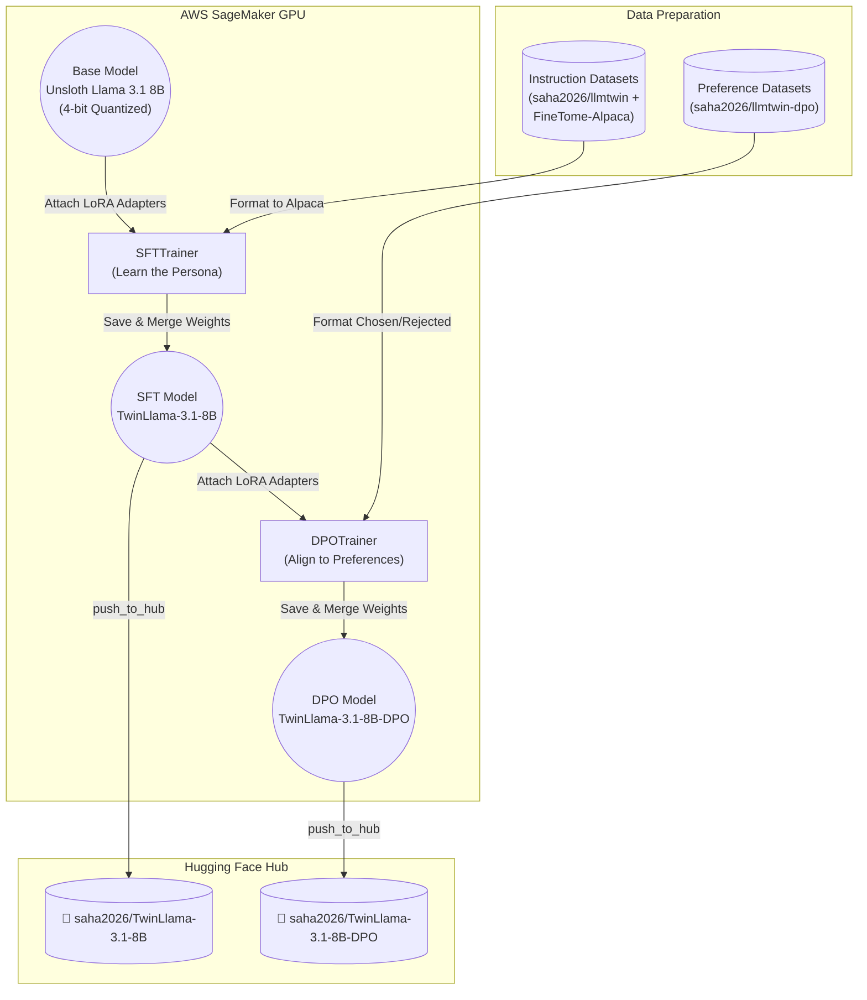
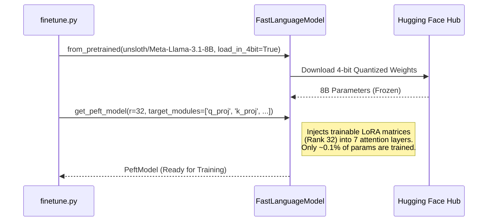
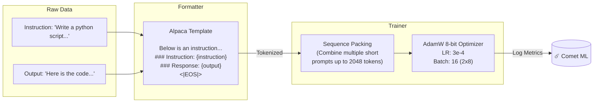
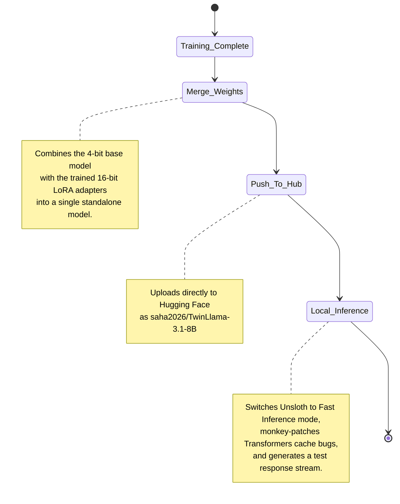

# 🧠 MoodSwarm Fine-Tuning Architecture

This document breaks down the internal architecture of the `finetune.py` script. It explains how the model was trained, what model was used, and the step-by-step data flow from raw instructions to a fully adapted LoRA model.

---

## 1. What Model Was Trained?
We fine-tuned **Meta Llama 3.1 8B** (`unsloth/Meta-Llama-3.1-8B`).
- **Why Unsloth?**: We used the `unsloth` repository version instead of `meta-llama` because Unsloth provides heavily optimized, pre-quantized (4-bit) weights. This allows a 8-Billion parameter model to be fine-tuned on a single 24GB VRAM GPU (like the `ml.g5.2xlarge` A10G instance we used) using **QLoRA** (Quantized Low-Rank Adaptation).

---

## 2. The High-Level Fine-Tuning Flow

The script supports two distinct phases of LLM training: **Supervised Fine-Tuning (SFT)** and **Direct Preference Optimization (DPO)**.

---

## 3. How QLoRA Works in Our Code

Instead of training all 8 Billion parameters (which would require massive server clusters), we strictly froze the 4-bit base Llama 3.1 model and only trained tiny "Adapter" layers injected into the attention mechanism. 

**LoRA Target Modules configured:**
- `q_proj` (Query), `k_proj` (Key), `v_proj` (Value), `o_proj` (Output)
- `gate_proj`, `up_proj`, `down_proj` (MLP layers)

---

## 4. The SFT (Supervised Fine-Tuning) Pipeline

During SFT, the model learns **how** to answer questions and **what** persona to adopt.

### Dataset Merging Strategy
We explicitly concatenating two datasets before passing them to the trainer:
1. `saha2026/llmtwin` (Your custom extracted corpus, ~200 specific samples).
2. `mlabonne/FineTome-Alpaca-100k` (A massive open-source dataset, trimmed to 10k samples).
*This prevents "catastrophic forgetting" where the model learns your persona but forgets how to be a general helpful assistant!*

---

## 5. Post-Training: Saving and Inference

Once the `SFTTrainer` finishes its 3 epochs, the script performs three critical final steps:

### The `_patch_dynamic_cache` Hack
During inference, older versions of Hugging Face Transformers crash when Unsloth tries to use optimized caching. In `finetune.py`, we explicitly append `"dynamic"` to `ALL_CACHE_IMPLEMENTATIONS` right before calling `model.generate()`. This allows the SageMaker instance to successfully complete the pipeline validation locally without crashing at the finish line!
