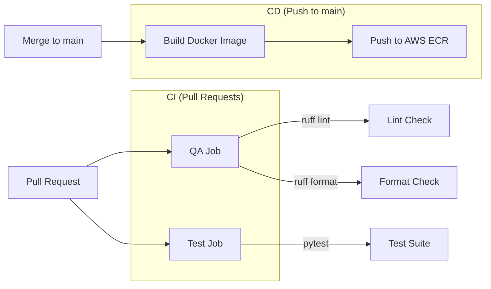

# Week 8: MLOps, CI/CD & Capstone

> Making the MoodSwarm system production-ready and operable by one person.

## Overview

Week 8 applies MLOps principles from Chapter 11 and the Appendix to the complete FTI pipeline built in Weeks 1-7. The focus is on **automation, testing, containerization, and operational documentation** — not cloud migration.

### MLOps Principles Applied

| Principle | Implementation |
|-----------|---------------|
| **Automation** | GitHub Actions CI/CD, pre-commit hooks |
| **Versioning** | Git (code), HuggingFace Hub (models/datasets), Poetry lock (deps) |
| **Experiment Tracking** | Comet ML / Opik (already from W5-W7) |
| **Testing** | pytest suite (unit + integration), ruff lint/format |
| **Monitoring** | Opik prompt tracing on `/rag` endpoint (already from W7) |
| **Reproducibility** | Docker container, pinned deps, deterministic chunk IDs |

## CI/CD Pipeline Architecture



### CI Workflow (`.github/workflows/ci.yml`)
- **Trigger:** All pull requests
- **QA job:** Ruff lint + format checks
- **Test job:** Full pytest suite with `OPIK_TRACK_DISABLE=true`
- **Concurrency:** Cancels in-progress runs on new pushes

### CD Workflow (`.github/workflows/cd.yml`)
- **Trigger:** Push to `main` branch
- **Build:** Docker image from `Dockerfile`
- **Push:** Tagged with commit SHA + `latest` to AWS ECR
- **Secrets needed:** `AWS_ACCESS_KEY_ID`, `AWS_SECRET_ACCESS_KEY`, `AWS_REGION`, `AWS_ECR_NAME`

## Testing Strategy

### Unit Tests (`tests/unit/`)

| Test File | What It Tests |
|-----------|---------------|
| `test_domain_models.py` | Query creation, DataCategory enum, field validation |
| `test_chunking.py` | Text cleaning, deterministic chunk IDs |
| `test_inference_executor.py` | Alpaca template formatting, LLM call mocking |
| `test_settings.py` | Settings defaults and types |

### Integration Tests (`tests/integration/`)

| Test File | What It Tests |
|-----------|---------------|
| `test_api_schema.py` | FastAPI app creation, `/rag` endpoint schema, POST handling |

### Running Tests

```bash
poetry poe test                    # All tests
poetry run pytest tests/unit/ -v   # Unit only
poetry run pytest tests/integration/ -v  # Integration only
```

## Docker Containerization

### Image: `python:3.11-slim-bullseye`

Key decisions:
- **Google Chrome included:** Required by `MediumCrawler` (Selenium-based)
- **Production deps only:** `--without dev` excludes ruff, pytest, pre-commit
- **Layer caching:** `pyproject.toml` + `poetry.lock` copied before source code
- **No virtualenv:** `virtualenvs.create false` — container IS the environment

### Build & Run

```bash
docker build -t moodswarm .
docker run --env-file .env -p 8000:8000 moodswarm poetry poe start-api
```

## Pre-commit Hooks

```yaml
# .pre-commit-config.yaml
repos:
  - ruff (lint + format)
  - gitleaks (secret scanning)
```

Install: `poetry run pre-commit install`
Run manually: `poetry run pre-commit run --all-files`

## Poe Task Runner

All CI/CD and operational commands available as Poe tasks:

```bash
poetry poe lint-check        # CI: ruff lint
poetry poe format-check      # CI: ruff format
poetry poe test              # CI: pytest
poetry poe deploy-endpoint   # Ops: deploy SageMaker
poetry poe delete-endpoint   # Ops: delete endpoint
poetry poe endpoint-status   # Ops: check endpoint
poetry poe start-api         # Ops: start FastAPI
```

## What's Not In Scope (and Why)

| Item | Reason |
|------|--------|
| MongoDB Atlas / Qdrant Cloud migration | Local Docker sufficient for solo builder; adds cost |
| ZenML Cloud | Local stack works; cloud adds cost |
| Data drift detection | Requires production traffic we don't have |
| CloudWatch alarms | No continuous endpoint; on-demand only |
| Auto-scaling | Single user; reference code available if needed |
